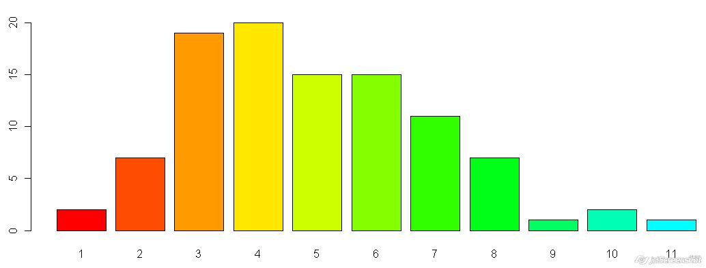

```{r setup, include=FALSE}
knitr::opts_chunk$set(echo = FALSE, warning = FALSE, cache = TRUE)
library(ggplot2)
library(ggthemes)
library(readxl)
library(extrafont)
font_import()
loadfonts(device = "win")
opros <- read_xlsx("ProgOprosEdited.xlsx")
```

# Вступление

Для того, чтобы создавать какое-либо системное или прикладное программное обеспечение,
следует изучить целевую аудиторию потенциального продукта и интересы его возможных
потребителей.

*Penza Street* заинтересована в создании инструментов, помогающих программистам,
поэтому решила провести опрос среди программистов и попытаться понять, что это
за люди, и чего они хотят.

Результаты исследования представлены ниже. Не все результаты были правильно и грамотно
интерпретированы, так как сама структура опроса обладала массой изъянов. Компания
*Penza Street* не рискнула проводить второй, более качественный опрос во избежание
утери доверия среди целевой аудитории.

О серьёзности некоторых выводов говорить не приходится, поэтому, надеемся, вам
понравится количество юмора в статье, ибо некоторые закономерности представляют из себя
откровенный бред (*Но, статистически вероятный бред*).

## От автора

*Penza Street Analitics* - дочерняя организация от *Penza Street Company*, уникальной
в своём роде компании. В чём её уникальность? Хотя бы в том, что все возможные
должности в ней занимает один человек, а сама компания не закреплена ни одним правовым
актом ни одной страны мира.

Так что, дорогие читатели. [*Павел Соломатин*](https://vk.com/crave_ozer_man), приятно познакомиться.

# Предупреждение!
В статье могут присутствовать циничные и даже оскорбительные для конкретных 
групп людей, но вполне цензурные, высказывания. Эти высказывания не отражают
позицию автора, а являются лишь стереотипами, не соответствующими жизни.

Автор уточняет, что дискриминационные высказывания не касаются расового,
национального и религиозного характера, что уже облегчает, если не отменяет 
наказание по законодательству РФ.

Наличие таких высказываний объясняется большим объёмом статьи, так как не каждый
дочитает до конца, не заснув. Автор попытался будить читателей смехом и
внутренним негодованием при прочтении.

# Список терминов
> Текст исследования изобилует профессиональным и простонародным жаргоном 
(а также результатом работы личного сленгогенератора). Поэтому для 
неподготовленных читателей здесь приведён краткий список непонятных терминов.

- Биг Дата - (от англ. Big Data) отрасль программирования, занимающаяся обработкой
больших объёмов данных
- Бородатый гуру - человек с высокой квалификацией в конкретной отрасли
- Буржуй - представитель буржуазного класса, он же зажиточный человек
- Веб - веб-разработка - разработка приложений, работающих в среде Интернет
- Великий Третий Змей - Python версии 3.0.0 и выше
- Геймер - игрок-любитель, либо профессионал
- Дата-саентист - (от англ. Data Science) работник в отрасли исследования и 
обработки данных
- Диструбутив - версия для распространения
- Информационный пролетариат - работники сферы IT
- Кодить - писать код
- Линух - траслитерационный перевод ОС Linux
- Малина - одноплатный компьютер Raspberry Pi
- Маргинал - индивид, которого трудно отнести к той или иной группе по конкретной
систематизации, чаще всего, по социальной
- Олимп-прогер - программист, чаще всего школьник, спецализирующийся на решении
олимпиадных заданий по программированию
- ОС - операционная система
- Питон - язык пограммирования Python
- Питонист - программист, пишущий код на Python
- Плюсы - язык программирования C++
- Полный профан - антоним для "бородатого гуру", человек, совершенно 
неразбирающийся в конкретной отрасли
- Прогер - программист
- Прокаченный комп - компьютер с хорошими показателями производительности,
благодаря хорошей сборке и программной оптимизации
- Пыха - язык программирования PHP
- Рандомный - случайный
- Ручное железо - программируемые микрокомпьютеры и микроконтроллеры
- Сахар - синтаксические конструкции, встроенные в языки программирования,
упрощающие написание и понимание кода.
- Сферический единорог в вакууме - образ чего-либо идеального
- Топить за ... - отстаивать ту или иную точку зрения
- Тянущий комп - компьютер, способный оперативно решать задачи, которые перед
ним ставит программист, независимо от уровня сложности операций
- Цзиньпин - глава КНР, а также язык программирования Си
- Чалиться - продолжительно находиться где-либо без особых притеснений
- Шарпы - язык программирования С\#
- Юзать - использовать, применять
- Яблоко-комп - компьютер марки Apple Macintosh
- Яблочная продукция - продукция компании Apple
- Яблоко-человек - пользователь продукции компании Apple

# История данных

Данные, использующиеся в опросе, были собраны за август 2019 года. В данных хранятся
сведения о `r nrow(opros)` программистах.

[Опрос](https://forms.yandex.ru/u/5d4336b07effdd03528c193c/) 
является до сих пор открытым, можете заполнить анкету. Это очень поможет
~~(смех из-под стола)~~.

Программисты по себе люди замкнутые и большинстве своём разрозненные личности.
Собрать их в одном месте было нелегко. Если вам когда-то повезло пройти этот опрос,
то скорее всего вы относились к этим категориям людей:

1. Выпускники Яндекс.Лицея 2019 года, которые были в офисе Яндекса на выпускном. 
(автор и сам таким является)
2. Участники летней смены образовательного центра "Сириус" 
(отдельная благодарность [*Алексею Медведеву*](https://vk.com/medal99) за помощь
в сборе данных)
3. Программисты Пензы, которые каким-либо образом знакомы с автором статьи.

# Математический аппарат исследования

> Кто считает себя бородатым гуру статистики или просто не хочет вникать в вот это
вот всё, может смело пропустить этот раздел.

> Кто совсем ничего не хочет понимать, пусть переходит к разделу "Распределение
ответов"

> Кто зашёл на пять минут, пусть сразу же переходит к разделу "Найденные 
взаимосвязи"

Математика - это всегда не просто, поэтому начнём издалека.

В основе исследования лежит статистика как наука в её чистом виде. Субъекты исследования - программисты. Объект исследования - предпочтения и навыки 
программистов и прочих посетителей опроса в мире информационных технологий.
В данном случае, ответы - это свойства объектов, то есть опрошенных.

Любые критерии могут быть разделены на качественные и количественные. Большинство
критериев в опросе было качественными, так как не было вопросов в стиле "оцените
это по шкале от 1 до 10". В это тоже есть минус опроса - нельзя ответить на вопрос
"сколько?". Качественные признаки ещё называют номинативными.

Однако, статистика на то и наука, что умеет много чего. Например:

*Для одной переменной*:

1. Если она качественная, проверить её на равномерность распределения (в каждой
группе элементы встречаются одинаково часто)
2. Если она количественная, проверить её на нормальность распределения (особый вид
распределения, выглядит как-то так)

За первый пункт отвечает 
[Критерий Хи-квадрат](https://en.wikipedia.org/wiki/Chi-squared_test),
а за второй 
[Тест Шапиро-Уилка](https://en.wikipedia.org/wiki/Shapiro%E2%80%93Wilk_test).

> Правда, как оказалось, данные вышли далеко не равномерные и не нормальные.
Но статистика и это может обойти

*Для двух переменных*:

1. Если обе качественные, то проверить их на связанность, или *корреляцию*.
2. Если одна качественная, а другая количественная, то проверить различие количественного
признака при разбиении на группы.
3. Если обе качественные, то проверить на пропорциональность групп по двум признакам.

За первый пункт отвечает [Коэфиициент корреляции Пирсона](https://en.wikipedia.org/wiki/Pearson_correlation_coefficient),
за второй - [Дисперсионный анализ](https://en.wikipedia.org/wiki/Analysis_of_variance),
а за третий - [Точный тест Фишера](https://en.wikipedia.org/wiki/Fisher%27s_exact_test)

> Правда, все первые два теста требуют "нормальности" данных, которой в этих данных нет.

Поэтому существуют их непараметрические аналоги:

1. [Коэффициент корреляции Кендала](https://en.wikipedia.org/wiki/Kendall_rank_correlation_coefficient)
2. [Тест Краскела-Уоллиса](https://en.wikipedia.org/wiki/Kruskal%E2%80%93Wallis_one-way_analysis_of_variance)

При визуализации данных будут использованы два вида графиков:

1. [Столбчатая гистограмма](https://en.wikipedia.org/wiki/Bar_chart)

2. [Диаграмма рассеяния](https://en.wikipedia.org/wiki/Scatter_plot)


# Программное обеспечение, использованное в исследовании

> Кто не хочет вникать в то, что такое R, и как было реализовано это исследование, может
смело пропускать этот раздел.

## Ссылки на программное обеспечение

В исследовании был использован язык программирования [**R**](https://www.r-project.org/)
версии `r getRversion()`.

Готовый файл статьи был получен с помощью пакета [RMarkdown](https://rmarkdown.rstudio.com)

Для визуализации был использован пакет [ggplot2](https://ggplot2.tidyverse.org/),
а также [ggthemes](https://CRAN.R-project.org/package=ggthemes). Для отображения
красивых шрифтов на графиках был использован пакет
[extrafont](https://CRAN.R-project.org/package=extrafont)

Для загрузки и выгрузки данных через формат .xlsx были использованы библиотеки
[readxl](https://CRAN.R-project.org/package=readxl) и
[writexl](https://CRAN.R-project.org/package=writexl)

## Код исследования

Дабы не грузить читателей кодовыми вставками, весь код исследования будет записан 
в одном месте - здесь.

Полную версию кода исследования можно увидеть на
[GitHub](https://github.com/PenzaStreetGames/ProgOpros)

```{r echo=TRUE, warning=FALSE, message=FALSE, cache=TRUE}
# rm(list = ls())
options(stringsAsFactors = TRUE)
library(readxl)
library(dplyr)
opros <- read_excel("ProgOprosEdited.xlsx")
opros <- select(opros, -number) # колонка номеров не нужна

# Функция, преобразующая набор строк в фактор (словарь)
factorise <- function(opros) {
  factoring_cols <-
    c(
      "gender",
      "status",
      "processor",
      "microboard",
      "desctop_os",
      "mobile_os",
      "editor_theme",
      "cycle_recursion",
      "cycle",
      "java_kotlin",
      "zero_division",
      "indexing",
      "typing",
      "slow_python",
      "list_mutable",
      "sugar",
      "list_expressions",
      "ternar_module",
      "patterns",
      "mobile_desctop",
      "web",
      "back_front_end",
      "flask_django",
      "python",
      "cpp",
      "javascript",
      "pascal",
      "csharp",
      "java",
      "c",
      "php",
      "kotlin",
      "lua",
      "scratch",
      "basic",
      "go",
      "ruby",
      "fasm",
      "bf",
      "haskel",
      "pycharm",
      "vscode",
      "idle",
      "notepad",
      "notepadpp",
      "wing",
      "sublime",
      "jupiter",
      "atom",
      "console",
      "machine_learning",
      "big_data",
      "metaprog",
      "quantum",
      "cryptography",
      "math"
    )
  colnames(opros)
  for (string in factoring_cols) {
    # print(string)
    opros[[string]] <- factor(opros[[string]])
  }
  
  return(opros)
}
df_struct <- list() # список, хранящий данные о структуре данных
df_struct$numeric_vars <- # список количественных переменных
  c(
    "languages_number",
    "editors_number",
    "future_number",
    "humour",
    "other_opinion",
    "sugar_using",
    "python_discontent",
    "middle_answers",
    "dont_know",
    "web_using",
    "apple"
  )
df_struct$quality_vars <- # список качественных переменных
  c(
    "gender",
    "status",
    "processor",
    "microboard",
    "desctop_os",
    "mobile_os",
    "editor_theme",
    "cycle_recursion",
    "cycle",
    "java_kotlin",
    "zero_division",
    "indexing",
    "typing",
    "slow_python",
    "list_mutable",
    "sugar",
    "list_expressions",
    "ternar_module",
    "patterns",
    "mobile_desctop",
    "web",
    "back_front_end",
    "flask_django",
    "python",
    "cpp",
    "javascript",
    "pascal",
    "csharp",
    "java",
    "c",
    "php",
    "kotlin",
    "lua",
    "scratch",
    "basic",
    "go",
    "ruby",
    "fasm",
    "bf",
    "haskel",
    "pycharm",
    "vscode",
    "idle",
    "notepad",
    "notepadpp",
    "wing",
    "sublime",
    "jupiter",
    "atom",
    "console",
    "machine_learning",
    "big_data",
    "metaprog",
    "quantum",
    "cryptography",
    "math"
  )
df_struct$vars <- colnames(opros) # список всех переменных
df_struct$simple_vars <- # список логически полных переменных
  c(
    "gender",
    "status",
    "processor",
    "microboard",
    "desctop_os",
    "mobile_os",
    "editor_theme",
    "cycle_recursion",
    "cycle",
    "java_kotlin",
    "zero_division",
    "indexing",
    "typing",
    "slow_python",
    "list_mutable",
    "sugar",
    "list_expressions",
    "ternar_module",
    "patterns",
    "mobile_desctop",
    "web",
    "back_front_end",
    "flask_django",
    "languages_number",
    "editors_number",
    "future_number",
    "humour",
    "other_opinion",
    "sugar_using",
    "python_discontent",
    "middle_answers",
    "dont_know",
    "web_using",
    "apple"
  )
df_struct$complex_vars <- # список сгруппированных переменных
  list(
    languages = c(
      "python",
      "cpp",
      "javascript",
      "pascal",
      "csharp",
      "java",
      "c",
      "php",
      "kotlin",
      "lua",
      "scratch",
      "basic",
      "go",
      "ruby",
      "fasm",
      "bf",
      "haskel"
    ),
    editors = c(
      "pycharm",
      "vscode",
      "idle",
      "notepad",
      "notepadpp",
      "wing",
      "sublime",
      "jupiter",
      "atom",
      "console"
    ),
    futures = c(
      "machine_learning",
      "big_data",
      "metaprog",
      "quantum",
      "cryptography",
      "math"
    )
  )
result <- list() # список для хранения промежуточных и итоговых результатов

opros <- factorise(opros) # факторизация всех сторковых столбцов
# str(opros)

## Стадия 1. Простая предобработка и гипотезы

# Simple tables
result$simple_tables <- apply(opros, 2, function(x) 
  round(prop.table(table(x)), digits = 3))

# Simple Fisher Test
result$simple_fisher_test <- apply(opros, 2, function(x)
  chisq.test(table(x)))

# Shapiro Test
result$shapiro_test <- lapply(opros[df_struct$numeric_vars], 
                              function(x) shapiro.test(x))

## Стадия 2. Двойные таблицы и взаимосвязи

# Double tables
result$double_tables <- lapply(opros, function(x)
  lapply(opros, function(y) round(prop.table(table(x, y)), digits = 3)))

# Check equals
# sapply(opros, function(x) 
#  sum(sapply(opros, function(y) all(as.vector(x) == as.vector(y)))))
# all rigth

# Double Fisher Test
result$double_fisher_test <- lapply(opros[df_struct$quality_vars], function(x) 
  lapply(opros[df_struct$quality_vars][sapply(opros[df_struct$quality_vars], function(z) !all(as.vector(x) == as.vector(z)))], 
         function(y) fisher.test(table(x, y), simulate.p.value = T)))

# Cor test Kendall
result$cor_test_kendal <- lapply(opros[df_struct$numeric_vars], function(x) 
  lapply(opros[df_struct$numeric_vars]
         [sapply(opros[df_struct$numeric_vars], function(z) !all(as.vector(x) == as.vector(z)))],
         function(y) cor.test(x, y, method = "kendall")))

# Kruskal test
result$kruskal_test <- lapply(opros[df_struct$numeric_vars], function(x)
  lapply(opros[df_struct$quality_vars], function(y)
    kruskal.test(x, y)))

## Исследование взаимосвязей

# Researching edges
get_edges <- function(data, level) {
  df <- data.frame(x = c(), y = c(), p = c())
  lapply(names(data), function(x)
    lapply(names(data[[x]]), function(y) 
    { 
      if (data[[x]][[y]]$p.value < level) 
        if (!(paste(x, y) %in% c(apply(df, 1, function(x) paste(x["x"], x["y"])),
                                 apply(df, 1, function(x) paste(x["y"], x["x"])))))
          df <<- rbind(df, data.frame(x = x, y = y, p = data[[x]][[y]]$p.value)) 
    }
    ))
  df <- df[df$p < level,]
  df$p_log <- abs(round(log(df$p, base = 10)))
  df
}

# Removing obvious edges in Kruskal test
remove_obvious_edges <- function(data) {
  obvious_edges <- list(
    humour = c("gender", "status", "editor_theme"),
    other_opinion = c("zero_division", "indexing", "typing"),
    python_discontent = c("slow_python", "list_mutable", "sugar"),
    sugar_using = c("list_expressions", "ternar_module", "patterns"),
    apple = c("mobile_os", "desctop_os"),
    dont_know = c("microboard", "list_expressions", "ternar_module", "patterns", "flask_django"),
    web_using = c("web", "flask_django"),
    middle_answers = c("processor", "desctop_os", "mobile_os", "cycle_recursion", 
                       "cycle", "java_kotlin", "slow_python", "list_mutable", "sugar",
                       "mobile_desctop", "flask_django"),
    languages_number = c("python", "cpp",
                         "javascript", "pascal", "csharp", "java", "c",
                         "php", "kotlin", "lua", "scratch", "basic",
                         "go", "ruby", "fasm", "bf", "haskel"),
    editors_number = c("pycharm", "vscode", "idle", "notepad",
                       "notepadpp", "wing", "sublime", "jupiter",
                       "atom", "console"),
    future_number = c("machine_learning", "big_data", "metaprog",
                      "quantum", "cryptography", "math")
  )
  answer <- data.frame(x = c(), y = c(), p = c(), p_log = c())
  apply(result$important_edges$kruskal_test, 1, function(x) {
    if (!(x[["x"]] %in% names(obvious_edges) & 
          any(sapply(unlist(obvious_edges[as.vector(x[["x"]])]), function(z) as.vector(x[["y"]]) == z)))) {
      answer <<- rbind(answer, data.frame(x = c(x["x"]), y = c(x["y"]), 
                                          p = c(x["p"]), p_log = c(x["p_log"])))
    }
  })
  row.names(answer) <- NULL
  answer
}

get_all_edges <- function(level) {
  result$important_edges$cor_test <<- get_edges(result$cor_test_kendal, level)
  result$important_edges$fisher_test <<- get_edges(result$double_fisher_test, level)
  result$important_edges$kruskal_test <<- get_edges(result$kruskal_test, level)
  result$important_edges$kruskal_test <<- remove_obvious_edges(result$important_edges$kruskal_test)
  
  # Uniting edges
  result$important_edges$all <<- rbind(result$important_edges$fisher_test, result$important_edges$cor_test,
                                       result$important_edges$kruskal_test)
  result$important_edges$all$x <<- as.character(result$important_edges$all$x)
  result$important_edges$all$y <<- as.character(result$important_edges$all$y)
  result$important_edges$all$p <<- as.numeric(result$important_edges$all$p)
  result$important_edges$all$p_log <<- as.numeric(result$important_edges$all$p_log)
  result$important_edges$all
}
result$important_edges$all <- get_all_edges(0.05)

find_opros_col <- function(x) {
  names(opros)[sapply(names(opros), function(y) all(as.vector(opros[[y]]) == as.vector(x)))]
}

# str(result$important_edges$all)
result$edged_vars <- lapply(opros, function(x) {
  x <- find_opros_col(x)
  r <- apply(result$important_edges$all[
    apply(result$important_edges$all, 1, function(y)
      y["x"] == x | y["y"] == x),], 1, function(y) {
        ifelse(y["x"] == x, y["y"], y["x"])
      })
  names(r) <- NULL
  r})
# result$edged_vars

result$edged_vars_list <- data.frame(var = df_struct$vars, 
                                     edged_vars = sapply(opros, function(x) {
                                       x <- find_opros_col(x)
                                       paste(result$edged_vars[[x]], collapse = " ")
                                     }))

var_labels <- c(gender = "Пол",
                status = "Социальный\nстатус",
                languages_number = "Количество используемых языков",
                editors_number = "Количество используемых редакторов",   
                future_number = "Количество выбранных перспективных отраслей",
                humour = "Коэффциент юмора",
                other_opinion = "Коэффициент другого мнения",
                python_discontent = "Коэффициент недовольства питоном",
                sugar_using = "Коэффициент использования синтаксического сахара",
                middle_answers = "Коэффициент лояльности ответов",
                dont_know = "Коэффициент незнания",
                web_using = "Коэффициент использования web'а",     
                apple = "Коэффициент лояльности к Apple",
                processor = "Выбор процессора",
                microboard = "Выбор микроплаты",
                desctop_os = "Выбор\nнастольной ОС",
                mobile_os = "Выбор\nмобильной ОС",
                editor_theme = "Выбор\nтемы редактора",
                cycle_recursion = "Цикл\nили\nрекурсия",
                cycle = "Выбор\nвида цикла",
                java_kotlin = "Java\nили\nKotlin",
                zero_division = "Мнение\nо делении\nна ноль",
                indexing = "Выбор индексации",
                typing = "Сколько будет\n1 + \"а\"",           
                slow_python = "Мнение\nо скорости\nпитона",
                list_mutable = "Отношение\nк изменяемости\nсписков в питоне",
                sugar = "Мнение\nо \"сахарности\"\nпитона",
                list_expressions = "Использование\nсписочных\nвыражений",
                ternar_module = "Использование\nтернарного\nмодуля",
                patterns = "Использование\nшаблонов\nпроектирования",
                mobile_desctop = "Мобильная\nразработка\nили\nдесктоп",
                web = "Необходимость\nвеба",           
                back_front_end = "Предпочитаемая\nотрасль\nвеба",
                flask_django = "Flask\nили\nDjango",
                python = "Использование\nPython",
                cpp = "Использование\nC++",        
                javascript = "Использование\nJavaScript",
                pascal = "Использование\nPascal",
                csharp = "Использование\nC#",
                java = "Использование\nJava",
                c = "Использование\nC",
                php = "Использование\nPHP",
                kotlin = "Использование\nKotlin",
                lua = "Использование\nLua",      
                scratch = "Использование\nScratch",
                basic = "Использование\nBasic",
                go = "Использование\nGo",
                ruby = "Использование\nRuby",
                fasm = "Использование\nFASM",
                bf = "Использование\nBrainfuck",
                haskel = "Использование\nHaskel",
                pycharm = "Использование\nPyCharm",
                vscode = "Использование\nVisual Studio\nCode",
                idle = "Использование\nIDLE",
                notepad = "Использование\nБлокнота",
                notepadpp = "Использование\nNotepad++",
                wing = "Использование\nWing",
                sublime = "Использование\nSublime Text",
                jupiter = "Использование\nJupiter\nNotebook",
                atom = "Использование\nAtom", 
                console = "Использование\nконсоли",
                machine_learning = "Ожидание\nразвития\nмашинного\nобучения",
                big_data = "Ожидание\nразвития\nбольших\nданных",
                metaprog = "Ожидание\nразвития\nметапрограммирования",        
                quantum = "Ожидание\nразвития\nквантовой\nлогики",
                cryptography = "Ожидание\nразвития\nкриптографии",
                math = "Ожидание\nразвития\nприкладной\nматематики")
spaced_var_labels <- sapply(var_labels, function(x) gsub("\n", " ", x))
full_var_labels <- c(
  python = "01. Python",
  cpp = "02. C++",        
  javascript = "03. JavaScript",
  pascal = "04. Pascal",
  csharp = "05. C#",
  java = "06. Java",
  c = "07. C",
  php = "08. PHP",
  kotlin = "09. Kotlin",
  lua = "10. Lua",      
  scratch = "11. Scratch",
  basic = "12. Basic",
  go = "13. Go",
  ruby = "14. Ruby",
  fasm = "15. FASM",
  bf = "16. Brainfuck",
  haskel = "17. Haskel",
  pycharm = "01. PyCharm",
  vscode = "02. Visual Studio\nCode",
  idle = "03. IDLE",
  notepad = "04. Блокнот",
  notepadpp = "05. Notepad++",
  wing = "06. Wing",
  sublime = "07. Sublime\nText",
  jupiter = "08. Jupiter\nNotebook",
  atom = "09. Atom", 
  console = "10. Консоль",
  machine_learning = "01. Машинное\nобучение",
  big_data = "02. Большие\nданные",
  metaprog = "03. Метапрограммирование",        
  quantum = "04. Квантовая\nлогика",
  cryptography = "05. Криптография",
  math = "06. Прикладная\nматематика"
)
var_positive_flags <- c(
  languages = "Использует",
  editors = "Использует",
  futures = "Ожидает"
)
complex_var_labels <- c(
  languages = "Популярность\nязыков\nпрограммирования",
  editors = "Популярность\nредакторов\nкода",
  futures = "Популярность\nвозможных\nпередовых\nотраслей"
)
spaced_complex_var_labels <- sapply(complex_var_labels, function(x) gsub("\n", " ", x))

## Отрисовка графиков

library(ggplot2)
library(extrafont)
loadfonts(device = "win")

theme_pablo <- theme(panel.background = element_rect(fill = "grey70"), 
                     plot.background = element_rect(fill = "grey60"),
                     legend.background = element_rect(fill = "grey80"),
                     text = element_text(family = "Comic Sans MS"),
                     axis.text.x = element_text(angle = 30, hjust = 1))

draw_plot <- function(x, y) {
  if (x %in% df_struct$numeric_vars & y %in% df_struct$numeric_vars) {
    random_colors <- colors()[sample(1:length(colors()), size = 2, replace = F)]
    plt <- ggplot(opros, aes(x = opros[[x]], y = opros[[y]], 
                             size = I(5), color = I(random_colors[1])))+
      geom_smooth(method = "lm", se = F, color = I(random_colors[2]), size = I(3))+
      geom_point()+
      scale_x_continuous(breaks = seq(1:10))+
      geom_jitter()+
      xlab(spaced_var_labels[x])+
      ylab(spaced_var_labels[y])+
      ggtitle(paste("Взаимосвязь переменных\n", spaced_var_labels[x], "и",
                    spaced_var_labels[y]))+
      theme_pablo
  }
  else if (x %in% df_struct$numeric_vars & y %in% df_struct$quality_vars) {
    plt <- ggplot(opros, aes(x = opros[[x]], fill = opros[[y]], color = I("black")))+
      geom_histogram(alpha = 0.8, binwidth = 1)+
      facet_wrap(~ opros[[y]], nrow = 3)+
      xlab(spaced_var_labels[x])+
      ylab("Частота")+
      ggtitle(paste("Взаимосвязь переменных\n", spaced_var_labels[x], "и",
                    spaced_var_labels[y]))+
      scale_fill_brewer(name = var_labels[y],
                        type = "qual", palette = sample(1:8, size=1))+
      scale_x_continuous(breaks = seq(1:10))+
      theme_pablo
  }
  else if (x %in% df_struct$quality_vars & y %in% df_struct$numeric_vars) {
    plt <- ggplot(opros, aes(x = opros[[y]], fill = opros[[x]], color = I("black")))+
      geom_histogram(alpha = 0.8, binwidth = 1)+
      facet_wrap(~ opros[[x]], nrow = 3)+
      xlab(spaced_var_labels[y])+
      ylab("Количество")+
      ggtitle(paste("Взаимосвязь переменных\n", spaced_var_labels[x], "и",
                    spaced_var_labels[y]))+
      scale_fill_brewer(name = var_labels[x],
                        type = "qual", palette = sample(1:8, size=1))+
      scale_x_continuous(breaks = seq(1:10))+
      theme_pablo
  }
  else if (x %in% df_struct$quality_vars & y %in% df_struct$quality_vars){
    plt <- ggplot(opros, aes(x = opros[[x]], fill = opros[[y]], color = I("black")))+
      geom_histogram(stat = "count")+
      facet_wrap(~ opros[[y]])+
      xlab(spaced_var_labels[x])+
      ylab("Количество")+
      ggtitle(paste("Взаимосвязь переменных\n", spaced_var_labels[x], "и",
                    spaced_var_labels[y]))+
      scale_fill_brewer(name = var_labels[y],
                        type = "qual", palette = sample(1:8, size=1))+
      theme_pablo
  }
  plt
}
draw_simple_plot <- function(x) {
  if (x %in% df_struct$quality_vars) {
    plt <- ggplot(opros, aes(x = opros[[x]], fill = opros[[x]], color = I("black")))+
      geom_histogram(stat = "count")+
      xlab(spaced_var_labels[x])+
      ylab("Количество")+
      ggtitle(paste("Распределение переменой\n", spaced_var_labels[x]))+
      scale_fill_brewer(name = var_labels[x],
                        type = "qual", palette = sample(1:8, size=1))+
      theme_pablo
  }
  else if (x %in% df_struct$numeric_vars) {
    random_color <- colors()[sample(1:length(colors()), size=1)]
    plt <- ggplot(opros, aes(x = opros[[x]], fill = I(random_color), color = I("black")))+
      geom_histogram(stat = "count")+
      xlab(spaced_var_labels[x])+
      ylab("Частота")+
      ggtitle(paste("Распределение переменной\n", spaced_var_labels[x]))+
      scale_fill_brewer(name = gsub(" ", "\n", var_labels[x]),
                        type = "qual", palette = sample(1:8, size=1), 
                        guide="colourbar")+
      scale_x_continuous(breaks = seq(1:10))+
      theme_pablo
  }
  plt
}
result$simple_plots <- lapply(opros, function(x) {
  x <- find_opros_col(x)
  plt <- draw_simple_plot(x)
  plt
})

draw_complex_plot <- function(x) {
  kit <- c()
  for (i in 1:length(unlist(df_struct$complex_vars[x]))) {
    y <- unlist(df_struct$complex_vars[x])[i]
    kit <- c(kit, 
             ifelse(opros[y] == var_positive_flags[x], full_var_labels[y], "none"))
  }
  kit <- data.frame(var = kit[kit != "none"])
  kit$var <- factor(kit$var)
  plt <- ggplot(kit, aes(x = var, fill = var, col = I("black")))+
    geom_histogram(stat = "count")+
    ggtitle(spaced_complex_var_labels[x])+
    xlab(spaced_complex_var_labels[x])+
    ylab("Частота")+
    scale_fill_brewer(name = "Частота",
                      type = "qual", palette = 3)+
    theme_pablo
  plt
}

result$complex_plots <- list()
result$complex_plots$languages <- draw_complex_plot("languages")
result$complex_plots$editors <- draw_complex_plot("editors")
result$complex_plots$futures <- draw_complex_plot("futures")

# gsub(" ", "_", gsub("\n ", "-", draw_plot("gender", "status")$labels$title))
# result$edged_vars
df <- data.frame(x = c(), y = c())
result$important_plots <- lapply(opros, function(x) {
  x <- find_opros_col(x)
  lapply(opros[unlist(result$edged_vars[x])], function(y) {
    y <- find_opros_col(y)
    plt <- draw_plot(x, y)
#      if (!(paste(x, y) %in% c(apply(df, 1, function(x) paste(x["x"], x["y"])),
#                             apply(df, 1, function(x) paste(x["y"], x["x"]))))) {
#      df <<- rbind(df, data.frame(x = x, y = y))
#      i <- gsub("\"", "", gsub(" ", "_", gsub("\n ", "-", plt$labels$title)))
#      ggsave(file = paste0(getwd(), "/plots/important_plots/", i, ".png"), 
#             plot = plt, device = "png")}
    plt})})

# Graph creating
library(igraph)
net <- list()
net$edges <- data.frame(from = result$important_edges$all$x,
                        to = result$important_edges$all$y,
                        weight = result$important_edges$all$p_log)
net$vertices <- data.frame(
  id = colnames(opros),
  type = ifelse(colnames(opros) %in% df_struct$numeric_vars, "numeric", "quality"))
graph <- graph.data.frame(net$edges, net$vertices, directed = F)
V(graph)$color <- ifelse(net$vertices$id %in% df_struct$numeric_vars, "orange", "skyblue")
E(graph)$width <- as.numeric(as.vector(net$edges$weight))
l <- layout.kamada.kawai(graph)
# result$egdes_graph <- plot(graph, layout= l, vertex.size = 15)

```

# Данные

## Ссылка

Используемые в опросе данные в предобработанном виде можно скачать по 
[ссылке](https://yadi.sk/i/WmRRsDzbnQ9H-g)

Для полноценной работы скрипта исследования следует скопировать файл данных в ту
же директорию, что и файл *Research.Rmd*.

## Структура данных

Всего в данных содержится `r length(colnames(opros))` признаков о 
`r length(rownames(opros))` программистах

> Быстро понять структуру данных можно, ознакомившись с 
[опросом](https://forms.yandex.ru/u/5d4336b07effdd03528c193c/)

> Рядом с переменной курсивом приведено её название в данных

### Качественные переменные

#### Общие признаки
- Пол *gender* 
  - Мужской
  - Женский
  - Кафельный (*пол не уточнён*)
- Социальный статус *status*
  - Школьник
  - Студент
  - Работяга (трудоустроенный программист)
  - Фрилансер (программист, работающий на заказ)
  - Аутсорсер (внештатный программист)
  - Пенсионер (*наличие пенсионеров в данных весьма странно - IT рынок России не настолько стар*)

#### Железо
- Предпочитаемая марка процессора *processor*
  - Intel
  - AMD
  - Всё равно
- Выбор микроплаты *microboard*
  - Arduino
  - Raspberry Pi
  - Не, не слышал

#### Программное обеспечение
- Предпочитаемая настольная ОС *desctop_os*
  - Windows
  - Linux
  - MacOS
  - Лишь бы был комп
- Предпочитаемая мобильная ОС *mobile_os*
  - Android
  - iOS
  - Лишь бы был телефон
- Тема редактора кода *editor_theme*
  - Светлая
  - Тёмная
  - Не фильтрованная (*тест на выявление алкопрогеров*)

#### Общепрограммистские вопросы
- Цикл или рекурсия? *cycle_recursion* (*варианты ответа очевидны, имеется средний ответ*)
- For или While? *cycle*
- Java или Kotlin? *java_kotlin*
- Мнение о делении на ноль *zero_division*
  - Ошибка
  - Так нельзя делать
  - Бесконечность
- Выбор индексации *indexing*
  - С нуля
  - С единицы
  - С произвольного числа
- Сколько будет 1 + "а"? *typing*
  - Ошибка типа
  - "1а"
  - 98 (то есть 1 + utf8 код символа "a")

#### Вопросы о питоне
- Мнение о скорости питона *slow_python*
  - Нормально
  - Терпимо
  - Побыстрее бы
- Отношение к изменяемости списков *list_mutable*
  - Позитивное
  - Нейтральное
  - Негативное
- Мнение о "сахарности" питона *sugar*
  - Слишком много сахара
  - Достаточно
  - Можно было послаще

#### Вопросы о использовании синтаскического сахара
- Использование тернарного модуля *ternar_module*
  - Не знал
  - Не использую
  - Редко
  - Часто
- Использование списочных выражений *list_expressions* (*ответы такие же*)
- Использование шаблонов проетирования *patterns*
  - Не знал о них
  - В питоне неприменимы
  - Редко
  - Часто
  
#### Вопросы о сферах программирования
- Мобильная или десктоп разработка? *mobile_desctop*
- Использование веба *web*
  - Нет
  - Как прилагающееся
  - Конечно
- Бек или фронт энд? *back_front_end*
  - Бек-энд
  - Фронт-энд
  - Фул-стек
- Flask или Django? *flask_django*
  - Flask
  - Django
  - Не знаю
  - Оба потянут
  - Оба не тянут
  
#### Используемые языки

В опросе было рассмотрено 17 наиболее известных ЯП 
(Dart не выбрал никто, в данных его нет). Каждому языку в данных соответствует 
переменная с его названием:

*python*, *cpp*, *javascript*, *pascal*, *csharp*, *java*, *c*, *php*, *kotlin*, 
*lua*, *scratch*, *basic*, *go*, *ruby*, *fasm*, *bf*, *haskel*

В переменных хранятся значения "Использует" или "Не использует" в зависимости от ответа

#### Используемые редакторы
В опросе было рассмотрено 10 редакторов кода, предпочтительно для питона,
включая консоль. Каждому редактору в данных соответствует переменная с его названием:

*pycharm*, *vscode*, *idle*, *notepad*, *notepadpp*, *wing*, *sublime*, *jupiter*,
*atom*, *jupyter*

В переменных хранятся значения "Использует" или "Не использует" в зависимости от ответа

#### Перспективные направления
В качестве разгрузочного вопроса участникам опроса предлагалось ответить, какие
из отраслей IT являются, по их мнению, перспективными. Предлагалось
6 отраслей: большие данные, машинное обучение, квантовая логика, криптография,
метапрограммирование и прикладная математика:

*big_data*, *machine_learning*, *quantum*, *cryptography*, *metaprog*, *math*

В переменных хранятся значения "Ожидает" или "Не ожидает" в зависимости от ответа

### Количественные переменные

Самым большим инструментарием по обработке данных статистика имеет для количественных
переменных. Однако, структура опроса была такова, что очевидными количественными
переменными были всего 3. Ещё 8 были получены путём объединения качественных переменных.

#### По имеющимся данным

- Количество языков программирования, которое знает программист *languages_number*
- Количество редакторов, используемых программистом *editors_number*
- Количество перспективных отраслей, которое видит программист *future_number*

#### Синтезированные из качественных
Эти переменные обладают относительной шкалой от 0 до 10.

- Чувство юмора (или маргинальность) *humour*
  - Ответы про пенсионера, кафельный пол и нефильтрованную тему повышают условный
  показатель "юмора"
- Другое мнение *other_opinion*
  - Нестандартные ответы на вопросы об индексации, типизации и делении на ноль
  повышают условный показатель "другого мнения"
- Недовольство питоном *python_discontent*
  - Негативные ответы о возможностях питона повышают условный показатель 
  "недовольства питоном"
- Использование синтаксического сахара *suger_using*
  - Использование тернарного модуля, списочных выражений и шаблонов проектирования
  повышают условный показатель "использования сахара"
- Лояльность ответов *middle_answers*
  - Количество компромиссных ответов
- Коэффициент незнания *dont_know*
  - Количество ответов в духе "Не знаю"
- Использование веба *web_using*
  - Количество наиболее объемлющих ответов по тематике веба
- Лояльность к Apple *apple*
  - Предпочтение macOS и iOS прочим продуктам

Ответы на все вопросы анкеты были обязательны и в некоторых местах не имели
подходящего ответа, в этом есть минус опроса. Зато, в данных нет ни одного
пропущенного значения.

Кому нечего делать, может пересчитать количество упомянутых переменных :)

# Распределения ответов
В этом разделе представлены распределения всех переменных в графическом и 
табличном виде, к каждому из которых приложено возможное объяснение.

Не у всех переменных есть таблица распределения. Это сделано для того, чтобы
уменьшить кровотечение из ваших глаз при лицезрении дробных величин в качестве
групп разделения.

## Физическо-психологические характеристики опрошенных
### Пол
```{r} 
result$simple_plots$gender
knitr::kable(result$simple_tables$gender)
```
*Выводы*:

1. Статистика явно не на стороне феминисток. Доля женщин в исследованном сегменте
ИТ статистически значимо меньше, чем доля мужчин
2. Зато представители меньшинств могут ликовать. Прогеры очень толерантны к ним.

### Социальный статус
```{r} 
result$simple_plots$status
knitr::kable(result$simple_tables$status)
```
*Выводы*:

1. В данных прослеживается явная возрастная перекошенность в сторону молодых. Это
свойство именно этой выборки, а не программистов в целом. 
2. 1 человек знал, что такое "Аутсорсер", либо это рандомный клик.
3. Несмотря на "молодость" выборки, суммарная доля студентов, работяг и пенсионеров
близка к четверти. Автор не считает слишком мнительным ставить под сомнение статус
пенсионера у некоторых опрошенных.

### Чувство юмора (или маргинальность)
```{r} 
result$simple_plots$humour
```
*Примечание*:

Неоднозначность названия критерия объясняется тем, что высший балл достался бы 
тому, чьи ответы были бы "кафельный пол", "пенсионер" и "нефильтрованная тема".
Психология подсказывает три возможные причины таких ответов: 

1. Человек обладает чувством юмора 
2. Человек не хочет распростараняться о себе, т. е. он гик
3. Человек обладает больной психикой, т. е. он конченный маргинал

*Выводы*:

1. ~~Хорошо, что~~ В данных не попалось ни одного "пенсионера кафельного пола,
предпочитающего нефильтрованную тему". Это говорит о неокончательной 
маргинализации программистов.
2. Программисты очень ответственно относятся к заполнению самых абсурдных форм
и не находят юмор всегда уместным.

### Лояльность ответов
```{r} 
result$simple_plots$middle_answers
```
*Выводы*:

1. Большинство опрошенных дали среднее количество компромиссных ответов
2. Особо яростных и непримиримых идеалистов, оказалось немного
3. Около правой границы графика можно увидеть небольшое возмущение. Это мудрецы,
проникшиеся вселенской гармонией, ищущие истину не в пределах, а в середине.
Там также могли оказаться мямли и потенциальные политики.

### Коэффициент незнания
```{r} 
result$simple_plots$dont_know
```
*Примечание*:

Опрос не имел перед собой задачи оценить умственные способности программистов.
В качестве понятия знания здесь взято количество ответов, которые могли бы дать 
самые рассудительные сотрудники ИТ.

*Выводы*:

1. Количество "полных профанов" в программировании не так уж велико
2. Хотя, возможна ситуцаия, что правильные ответы просто навязаны взглядом 
большинства

### Количество перспективных отраслей, которое видит программист
```{r} 
result$simple_plots$future_number
knitr::kable(result$simple_tables$future_number)
```

*Выводы*:

1. Часть испытуемых тупо выбрала всё, что не есть хорошо
2. Оптимальное число возможных перспективных отраслей - 3

### Самые популярные возможные перспективные отрасли
```{r} 
result$complex_plots$futures
```
*Выводы*:

1. Абсолютное большинство горой стоит за то, что машинное обучение станет 
передовой отраслью. Страшным сном программистов мог бы стать искусственный
интеллект, пишуший программы.
2. Немного меньший процент опрошенных считает Биг Дату перспективной отраслью
3. Метапрограммирвование, квантовая логика и криптография обладают мнением
о перспективности меньше среднего.
4. Программисты не любят или не видят применение прикладной математики

## Железо
### Выбор процессора
```{r} 
result$simple_plots$processor
knitr::kable(result$simple_tables$processor)
```
*Выводы*:

1. Intel  пользуется большей популярностью в массах, нежели AMD
2. Одна пятая, которой "всё равно", либо является представителями буржуазии, 
у которых комп настолько прокачен, что тянет всё, либо это пожилые геймеры, которым
хватает игры [Super Mario Bros](https://supermariobros.io), которая, как известно, 
не так требовательна к ресурсам ПК.

### Выбор микроплаты
```{r} 
result$simple_plots$microboard
knitr::kable(result$simple_tables$microboard)
```
*Выводы*:

1. Отмечена высокая осведомлённость программистов в области "ручного железа"
2. Хотя сравнение микроконтроллера и одноплатного компьютера было не совсем логичным,
оно стало интересным индикатором знаний программиста (*см. ниже*)

## Программное обеспечение
### Предпочитаемая настольная ОС
```{r} 
result$simple_plots$desctop_os
knitr::kable(result$simple_tables$desctop_os)
```
*Выводы*:

1. Окна являются наиболее популяной ОС среди программистов, хотя Linux с его
армией дистрибутивов являются неплохим подспорьем майкрософтовской гегемонии.
2. Количество пользователей яблоко-компов допустимо невелико, однако миру приходится 
считаться с их существованием.

### Предпочитаемая мобильная ОС
```{r} 
result$simple_plots$mobile_os
knitr::kable(result$simple_tables$mobile_os)
```
*Выводы*:

1. Доля предпочтения андроида указывает на успешность социалистической 
революции и процветание пролетариата. Доля ~~буржуев~~ пользователей Apple 
в мобильном секторе значительно меньше.

### Лояльность к Apple
```{r} 
result$simple_plots$apple
```
*Выводы*:

1. Не так уж и много людей, полностью одобряющих яблочную продукцию
2. ~~Процентное отношение нелояльных к эпплу программистов в приближении равно
доле бедных людей в России.~~ На самом деле их (бедных) всего 12% :)
3. На основе этого распределния *далее* будет сделана интересная закономерность 

### Тема редактора кода
```{r} 
result$simple_plots$editor_theme
knitr::kable(result$simple_tables$editor_theme)
```
*Выводы*:

1. Программисты давно выбрали свою 
[сторону силы](https://ru.wikipedia.org/wiki/%D0%97%D0%B2%D1%91%D0%B7%D0%B4%D0%BD%D1%8B%D0%B5_%D0%B2%D0%BE%D0%B9%D0%BD%D1%8B).
2. Обнаружена массивная группа алконавтов - около 10% опрошенных.
3. Совет для тех, кто выбрал светлую тему: оглядывайтесь почаще.

### Количество редакторов, используемых программистом
```{r} 
result$simple_plots$editors_number
knitr::kable(result$simple_tables$editors_number)
```

*Примечания*:

1. Следует учитывать, что опрос проводился среди питонистов, и редакторы 
предлагались для питона. Возможно, на самом деле, используемых редакторов могло
быть больше.

*Выводы*:

1. Большинству для счастья много не надо
2. Все десять предложенных редакторов использовать никто не додумался

### Самые популярные редакторы
```{r} 
result$complex_plots$editors
```

*Примечания*:

1. Следует учитывать, что опрос проводился среди питонистов, и редакторы 
предлагались для питона. Возможно, есть и другие популярные редакторы.

*Выводы*:

1. С кратным отрывом среди питонистов более популярным является PyCharm.
Хвала компании JetBrains за качественное ПО, доступное не всегда по лицензионным
ключам.
2. Wing, активно предлагаемый студентам Яндекс.Лицея на первом году обучения
в общей массе не получил должного распространения.
3. IDLE, Блокнот и Notepad++, несмотря на небольшой фунционал (особенно у 
Блокнота) являются достаточно популярными.
4. Хоть VS Code является лишь редактором кода, а не средой разработки, он занял
второе место.
5. Sublime Text, Jupyter Notebook и Atom являются достаточно мощными 
инструментами, но не находящими достаточного одобрения информационного 
пролетриата
6. Нашлись извращенцы, которые кодят в консоли. Хотелось бы посмотреть на то, как
они пилят проекты.

## Общепрограммистские вопросы
### Количество языков программирования, которое знает программист
```{r} 
result$simple_plots$languages_number
knitr::kable(result$simple_tables$languages_number)
```

*Выводы*:

1. Оптимальное количество используемых языков - 2
2. Достаточно большие группы программистов встречаются вплоть до 7 языков
3. Лучший результат - 10 из 17 предложенных языков. Этот человек, либо машина,
либо кремлебот, ибо пропаганду приходится распространять на разных сайтах и платформах.

### Самые популярные языки программирования
```{r} 
result$complex_plots$languages
```
*Примечания*:

1. Вариант ответа "Pascal" появился не с самого начала опроса, поэтому, его 
реальная доля используемости может быть больше.
2. На все языки не хватило цветов палитры диаграммы. Это лишний раз подчёркивает
маловажность непопулярных вариатов.
3. Исследование написано на языке R, который даже не предлагался в опросе. Автор
исследования и сам не ожидал, что писать придётся на нём.

*Выводы*:

1. А что вы ещё ожидали, если опрос проводился среди питонистов. Однако,
не все `r nrow(opros)` опрошенных используют питон.
2. На втором месте по популярности идут плюсы, и делают это совершенно заслуженно.
Язык мощный, быстрый и всеобъемлющий.
3. Далее идёт JavaScript и старина Pascal. Первый знаменит веб-разработкой на нём,
а второй тем, что школьники всей нашей многонациональной, стремящейся быть
цифровой сверхдержавой, страны начинают знакомство с программированием именно
с этого 
[пятидесятилетнего деда](https://ru.wikipedia.org/wiki/%D0%9F%D0%B0%D1%81%D0%BA%D0%B0%D0%BB%D1%8C_(%D1%8F%D0%B7%D1%8B%D0%BA_%D0%BF%D1%80%D0%BE%D0%B3%D1%80%D0%B0%D0%BC%D0%BC%D0%B8%D1%80%D0%BE%D0%B2%D0%B0%D0%BD%D0%B8%D1%8F))
4. Далее следуют C# (музыканты его ещё называют до-бемоль) и Java. Как Микрософт
и Оракл не соревновались в создании языка на виртуальной машине, выиграть
расположение этого сектора прогеров у них не получилось.
5. Далее идут Си и PHP (в простонародье - пыха). Первый никогда не умрёт (если
только из-за плюсов), а второй до сих пор терроризирует всю интернет-безопасность
своими вставками в формы.
6. Kotlin оказался слишком молодым и незрелым, но у него есть все шансы занять
место джавы под солнцем.
7. Далее по популярности следуют Lua, Scratch и Basic. Автор не находит, ни слов
ни стереотипов о языке Lua, поэтому воздержится от комментария. 
Scracth - вот с чего надо начинать знакомство с программирвоанием - наглядно и 
просто. Что же касается Бейсика, то непонятно, почему этот современник Фортрана
до сих пор коптит небо и пачкает своими манускриптами листы ГИА.
8. Go чалится на дне топ-листа рядом с Ruby (он же оксид алюминия с примесью 
хрома), FASM (разновидность ассемблера) и Brainfuck (воздержусь от нецензурных
переводов и назову его "Вынос мозга", хотя это не передаёт всей его сущности)
9. Подпирает дно топ-листа функциональный язык Haskel. (no comments)

### Цикл или рекурсия?
```{r} 
result$simple_plots$cycle_recursion
knitr::kable(result$simple_tables$cycle_recursion)
```
*Выводы*:

1. Половина опрошенных прониклись вселенской мудростью и нашли оба подхода:
объектный и функциональный - применимыми в конкретных случаях.
2. Малый процент выбравших рекурсию можно объяснить тем, что многие так и не смогли
из неё выбраться.

### For или While?
```{r} 
result$simple_plots$cycle
knitr::kable(result$simple_tables$cycle)
```
*Выводы*:

1. Большинство опрошенных не застали времена ассемблера, поэтому сочли встроенную
переменную в цикле for более удобной.
2. Количество проникшихся вселенской мудростью по этому вопросу оказалось меньше,
по сравнению с прошлым вопросом.

### Java или Kotlin?
```{r} 
result$simple_plots$java_kotlin
knitr::kable(result$simple_tables$java_kotlin)
```
*Выводы*:

1. Это одна из немногих переменных, которая распределилась практически равномерно
2. Ровным счётом непонятно, что же лучше и как быть
3. Холиварная война по предпочтению java и kotlin могла бы привести к полной 
[аннигиляции](https://ru.wikipedia.org/wiki/%D0%90%D0%BD%D0%BD%D0%B8%D0%B3%D0%B8%D0%BB%D1%8F%D1%86%D0%B8%D1%8F) 
программистов.

### Мнение о делении на ноль
```{r} 
result$simple_plots$zero_division
knitr::kable(result$simple_tables$zero_division)
```
*Выводы*:

1. Занудное большинство считает всё необычное и неоднозначное поломкой системы и
стремится во что бы то ни стало избегать таких ситуаций.
2. Сердце радуется за наличие среди прогеров этих 23% от общей массы, которые,
возможно, разбираются в пределах.
3. Юные [Пьеры Ланцели](https://ru.wikipedia.org/wiki/%D0%92%D0%B0%D0%BD%D1%86%D0%B5%D0%BB%D1%8C,_%D0%9F%D1%8C%D0%B5%D1%80_%D0%9B%D0%BE%D1%80%D0%B0%D0%BD) 
и ответвления большинства составляют около 12%.

### Выбор индексации
```{r} 
result$simple_plots$indexing
knitr::kable(result$simple_tables$indexing)
```
*Выводы*:

1. Программисты почти превратились в компьютеры, ибо разделяют их нумерацию с нуля.
2. Истинные мечтатели программирования и ярые революционеры знают, где трава зеленее

> Не во всех современных языках программирования нумерация начинается с нуля. 
Например в R нумерация начинается с единицы, а в Паскале ~~(кто-то назвал его 
современным :) )~~ - с произвольного числа. 

### Сколько будет 1 + "a"?
```{r} 
result$simple_plots$typing
knitr::kable(result$simple_tables$typing)
```
*Выводы*:

1. Большиство, вторя всяким питонам и джавам, говорит, что смешение типов невозможно.
2. Доля любителей слабой типизации достаточно велика.

### Другое мнение
```{r} 
result$simple_plots$other_opinion
```
*Примечание*:

1. Данный критерий оценивал количество ответов, несовпадающих с ответами 
большинства по спорным вопросам программирования (деление на ноль, индексирование 
и типизация)
2. Коэффииент и не носил бы другого названия, если бы большинство по этой шкале 
получило ноль.

*Выводы*:

1. Не нашлось ни одного, кто-бы получал бы ∞ при делении на ноль, индексировал
массивы с произвольного числа и получал 98 при сложении 1 и "a". А хотелось
бы взглянуть на этого "сферического единорога в вакууме"
2. Достаточно много программистов дали ответы, несильно отличающиеся от ответов
большинства.

## Вопросы о питоне
### Мнение о скорости питона
```{r} 
result$simple_plots$slow_python
knitr::kable(result$simple_tables$slow_python)
```
*Выводы*:

1. Где-то внутри столбика "побыстрее бы" прячутся ленивые олимп-прогеры и 
дата-саентисты.
2. Около половины программистов вообще не парится
3. Доля терпил довольно высока.

### Отношение к изменяемости списков
```{r} 
result$simple_plots$list_mutable
knitr::kable(result$simple_tables$list_mutable)
```
*Выводы*:

1. С одной стороны, изменяемость списков (и прочих изменяемых коллекций) 
позволяет менять элементы без необходимости копирования всего списка.
2. Но с другой стороны, она вызывает геморроидальные боли при записи 
элементов якобы "разных" списков. Поэтому в данном случае, их всё равно 
приходится копировать.
3. Как бы там ни было, большинство ответов составил вариант "позитивно"

### Мнение о "сахарности" питона
```{r} 
result$simple_plots$sugar
knitr::kable(result$simple_tables$sugar)
```
*Выводы*:

1. Основная масса вполне довольна удобством методов питона. Конечно, ведь по 
сравнению с другими языками, это просто спаснение от соблюдения типизации и 
расстановки скобок и точек с запятой.
2. Четверть даже не потянула всей мощи Великого Третьего Змея.
3. Количество диабетиков и сладкоежек составило ~ 11% от опрошенных

### Недовольство питоном
```{r} 
result$simple_plots$python_discontent
```

*Примечания*:

1. Мнение людей, не использующих питон, не учитывались, так как нельзя критиковать
то, о чём даже не знаешь.

*Выводы*:

1. Было бы странно увидеть группу людей, полностью недовольным питоном, но
активно использующим его.
2. Возможно, люди ждут чего-то болшего, чем питон

## Вопросы о использовании синтаскического сахара
### Использование тернарного модуля
```{r} 
result$simple_plots$ternar_module
knitr::kable(result$simple_tables$ternar_module)
```

*Выводы*:

1. Тернарный модуль является довольно популярной конструкцией, к тому же,
относительно удобной.
2. 14% от опрошеных составляют те, для кого тернарный модуль является относительно
неудобным. Это лишний раз доказывает относительность полезности языковых плюшек

### Использование списочных выражений
```{r} 
result$simple_plots$list_expressions
knitr::kable(result$simple_tables$list_expressions)
```
*Выводы*:

1. Девять десятых опрошенных хоть раз пробовали и часть из них осознали всю мощь
циклов внутри квадратных скобок
2. Отмечена большая просвященность программистов в этом вопросе

### Использование шаблонов проетирования
```{r} 
result$simple_plots$patterns
knitr::kable(result$simple_tables$patterns)
```
*Выводы*:

1. Вопрос проектирования ООП не затронул 40% от опрошенных
2. Автор солидарен с мнением о неприменимости шаблонов проектирования в питоне.
По крайней мере, автор не застал ни одной реализации 
[абстрактной фабрики](https://ru.wikipedia.org/wiki/%D0%90%D0%B1%D1%81%D1%82%D1%80%D0%B0%D0%BA%D1%82%D0%BD%D0%B0%D1%8F_%D1%84%D0%B0%D0%B1%D1%80%D0%B8%D0%BA%D0%B0_(%D1%88%D0%B0%D0%B1%D0%BB%D0%BE%D0%BD_%D0%BF%D1%80%D0%BE%D0%B5%D0%BA%D1%82%D0%B8%D1%80%D0%BE%D0%B2%D0%B0%D0%BD%D0%B8%D1%8F)) или 
[моста](https://ru.wikipedia.org/wiki/%D0%9C%D0%BE%D1%81%D1%82_(%D1%88%D0%B0%D0%B1%D0%BB%D0%BE%D0%BD_%D0%BF%D1%80%D0%BE%D0%B5%D0%BA%D1%82%D0%B8%D1%80%D0%BE%D0%B2%D0%B0%D0%BD%D0%B8%D1%8F)) в деле.
3. Половина опрошенных в той или иной мере использует паттерны проектирования

### Использование синтаксического сахара
```{r} 
result$simple_plots$sugar_using
```
*Выводы*:

1. Особо выделяются из распределения две группы: довольно большая группа, не
использующая ничего и примерон такая же по габаритам группа, участники которой
используют всё и часто.
2. Больше всего опрошенных используют "сахар" 50 на 50.

## Вопросы о сферах программирования
### Мобильная или десктоп разработка?
```{r} 
result$simple_plots$mobile_desctop
knitr::kable(result$simple_tables$mobile_desctop)
```
*Выводы*:

1. Более трети имеют достаточно инертное мнение по предпочтению мобильной или
настольной разработки
2. Доля "настольников" соразмерна доле безразличных и философов
3. Доля любителей покодить под смартфоны приблизительно равна четверти от всего
объёма

### Необходимость веба
```{r} 
result$simple_plots$web
knitr::kable(result$simple_tables$web)
```
*Выводы*:

1. Более 85% опрошенных признают важность веба, правда, половина из них видит в 
нём лишь интерфейс для пользовательских проектов
2. Остальные 15%, вероятно, ожидают прихода суперприложений и исчезновения 
браузеров в статусе архаизмов.

### Бек или фронт энд?
```{r} 
result$simple_plots$back_front_end
knitr::kable(result$simple_tables$back_front_end)
```
*Выводы*:

1. Куда больше прогеры любят побэкендить, нежели пофронтендить. Что, впрочем,
логично, ведь опрашивались программисты, а не дизайнеры.
2. Также программисты предпочитают запереться в танке и топить и за фронт, и за 
тыл. Пофулстечить, так сказать.

> (здесь должна была быть реклама игры про танки, но мне не заплатили)

### Flask или Django?
```{r} 
result$simple_plots$flask_django
knitr::kable(result$simple_tables$flask_django)
```
*Выводы*:

1. Пессимистов в вопросе возможностей этих двух фреймворков, оказалось довольно 
мало
2. Вселенская мудрость вновь подсказала большинству, что важен не функционал,
а применимость его в конкретных ситуациях. "Оба потянут" - таков самый популярный
ответ.
3. Частота ответа "Не знаю" показывает, что вопрос веб-разработки в питоне не
интересовал около четверти опрошенных
4. С небольшим отрывом Джанго опережает Фласк

### Использование веба
```{r} 
result$simple_plots$web_using
```
*Выводы*:

1. Веб используется программистами довольно хорошо
2. По форме график напоминает распределение переменной "использование
синтаксического сахара" (об этом *ниже*)

# Найденные взаимосвязи переменных
Сначала, была принята попытка найти взаимосвязь визуально между всеми возможными
комбинациями переменных. Но комбинаторика была не на стороне исследователя,
ведь комбинаций было около 3000. Выбрать что-то не только статистически вероятное,
но и интересное оказалось слишком сложно.

Далее была попытка визуализироввать взаимосвязь переменных в виде графа с учётом
статистической значимости связей. Получилось что-то такое:
```{r}
library(igraph)
plot(graph, layout= l, vertex.size = 15)
```

Если вам кажется, что это не очень-то понятно и наглядно, то вам не кажется.
На одном графе указаны 67 вершин и 225 связей между ними. О читаемости такой 
информации говорить не приходится.

Последняя и итоговая попытка была реализована следующим образом. Сначала с помощью
функциональной мощи языка R и статистических методов были найдены связи,
которые *статистически вероятно* существуют. 

Далее графики этих связей исследовались на предмет понятности имеющихся 
в них зависимостей. В итоговый документ вошли только те графики зависимостей, 
которые автор смог бы  объяснить не только себе, но и другим. 
Автор оставляет за любым заинтересовавшимся право на исследование прочих, 
неопубликованных взаимосвязей и публикацию их в отдельном исследовании.

> Поздравляю тех, кто дочитал до этого момента! Сейчас начнётся самое 
интересное...

> И ещё. Если названии графика написано: "Взаимосвязь переменных A и B",
то это не значит, что A зависит от B, или B зависит от A. Направление 
зависимости может быть любым, а также этой взаимосвязи может не существовать
вообще :D Но автор старался подобрать *статистически вероятные* зависимости.

> Статистическая вероятность существования взаимосвязей проверялась с помощью
точного критерия Фишера, корреляции Кендала и критерия Краскела-Уолесса.
Статистически вероятной считалась связь, p-уровень значимости которой меньше 0,05.

## Так всё-таки Java или Kotlin?!
### Java или Kotlin и использование Kotlin
```{r}
result$important_plots$java_kotlin$kotlin
knitr::kable(result$double_tables$kotlin$java_kotlin)
```

*Выводы*:

1. Ну вот теперь всё ясно! Почти все, кто использовал kotlin, выбрали именно его.
2. Остальная серая масса была вольна говорить всё, что заблагорассудится

### Java или Kotlin и Социальный статус
```{r}
result$important_plots$java_kotlin$status
knitr::kable(result$double_tables$java_kotlin$status)
```

*Выводы*:

1. Из всей информации на графике надо заметить две вещи. Во-первых, работяги чаще 
выбирают Java.
2. Во-вторых студенты в большинстве своём выбирают Kotlin.

### Java или Kotlin и Предпочиатемая отрасль веба
```{r}
result$important_plots$java_kotlin$back_front_end
knitr::kable(result$double_tables$java_kotlin$back_front_end)
```

*Выводы*:

1. Нельзя сказать, что бек-эндерам фиолетово, но их мнение весьма лояльно к выбору
между собратьями по JVM.
2. Фронт-эндеры предпочитают джаву, непонятно почему
3. Фул-стекеры на стороне Kotlin, но это не точно

### Java или Kotlin и Выбор микроплаты
```{r}
result$important_plots$java_kotlin$microboard
knitr::kable(result$double_tables$java_kotlin$microboard)
```

*Выводы*:

1. Выбравшие Arduino более благосколнны к джаве
2. Выбравшие Малину предпочитают котлин
3. Остальным однофигственно

### Java или Kotlin и Тема редактора
```{r}
result$important_plots$java_kotlin$editor_theme
knitr::kable(result$double_tables$java_kotlin$editor_theme)
```

*Выводы*:

1. Любители светлой темы недолюбливают котлин
2. Несильно намного, но среди "тёмных" лидирует котлин
3. Нефильтрованным не до этого противостояния, видимо под нефильтрованное не 
заходит

### Java или Kotlin и Количество языков
```{r}
result$important_plots$java_kotlin$languages_number
knitr::kable(result$double_tables$java_kotlin$languages_number)
```

*Выводы*:

1. Выбравшие котлин испоьзуют больше языков
2. Те, кому роли не играет, ~~умом не вышли~~ знают максимум 5 языков
3. Джава идёт среднячком

### Java или Kotlin и Коэффициент незнания
```{r}
result$important_plots$java_kotlin$dont_know
knitr::kable(result$double_tables$java_kotlin$dont_know)
```

*Выводы*:

1. Лишнее доказательство большего уровня "кодовой культурности" среди котлинистов
(или котлинёров, или котлинщиков, в общем, не суть)

## Скажи какой процессор, и я скажу, кто ты
### Выбор процессора и тема редактора
```{r}
result$important_plots$processor$editor_theme
knitr::kable(result$double_tables$processor$editor_theme)
```

*Примечания*:

1. По состоянию на 2020 год о главенстве Интела говорить не приходится, ведь
АМД давно выпустила 16-поточный [Ryzen](https://ru.wikipedia.org/wiki/Ryzen),
который снится Интелу.
Предпочтение большинством именно Intel можно объяснить заработанным имиджем
среди российского айти-пролетариата.

*Выводы*:

1. Любители светлой темы не переваривают AMD. Это уже второе доказательство 
биологической изолированности этого вида
2. Приспешники Дарта Вейдера топят за Intel
3. В очередной раз автор поражается аморфности этих ~~алкашей~~ любителей 
нефильтрованной темы. Это даже не мнение большинства, а какой-то рандом.

### Выбор процессора и коэффициент незнания
```{r}
result$important_plots$processor$dont_know
knitr::kable(result$double_tables$processor$dont_know)
```

*Выводы*:

1. График говорит сам за себя. Предпочитающие AMD отличаются высокой программной
грамотностью.
2. У интелистов тоже неплохой результат, но замечены выбросы в сторону полного
незнания.

## Статистика и Тайны веба
### Отрасль веба и количество редакторов
```{r}
result$important_plots$back_front_end$editors_number
knitr::kable(result$double_tables$back_front_end$editors_number)
```

*Выводы*:

1. Бек-эндерам (заднеконечным, в дословном переводе) трёх редакторов кода для
полного счастья хватает
2. Запросы фул-стекеров немного выше - до 5 редакторов
3. Передне-конечные (они же фронт-эндеры) буквально "размазаны" вдоль оси абсцисс.
Что не удивительно, код редактировать приходится на совершенно разных наречиях:
от html и css до php и javascript. Хотя WebStorm и PhpStorm от JetBrains неплохо
включают в себя перечисленный функционал, о них речь не шла.

### Отрасль веба и использование JavaScript
```{r}
result$important_plots$back_front_end$javascript
knitr::kable(result$double_tables$javascript$back_front_end)
```

*Выводы*:

1. Использование JavaScript весьма характерно для фул-стекеров. Он зарекомендовал
себя как язык по обе стороны веба
2. Однако, как ни странно, достаточно малая доля разработчиков 
клиентской части использует недоджаву-перескрипт (он же javascript). 
Возможно, стандартных бустраповских форм и скриптов им вполне хватает.

### Отрасль веба и использование Go
```{r}
result$important_plots$back_front_end$go
knitr::kable(result$double_tables$go$back_front_end)
```

*Выводы*:

1. Непонятно с чем это связано, но использующие Go программисты предпочитают 
только фул-стек. Наверное, это почётные кавалеры ордена программного кода,
знающие что и как кодить.

### Отрасль веба и использование Notepad++
```{r}
result$important_plots$back_front_end$notepadpp
knitr::kable(result$double_tables$notepadpp$back_front_end)
```

*Выводы*:

1. Унтер-блокнот (он же notepad++) имеет большее влияние на разработчиков 
фронт-энда и фул-стека, нежели бек-энда

### Необходимость веба и использование JavaScript
```{r}
result$important_plots$web$javascript
knitr::kable(result$double_tables$javascript$web)
```

*Выводы*:

1. Самое странное в графиках - когда на месте столбца гистограммы ничего нет.
Не знаю, какая секта проповедует JS, но её участники свято верят в необходимость 
веба.

### Использование веба и использование JavaScript
```{r}
result$important_plots$web_using$javascript
knitr::kable(result$double_tables$javascript$web_using)
```

*Выводы*:

1. Знание JavaScript однозначно повышает интернет-грамотность программиста
2. Однако, автор бы не сказал, что оно прямо-таки обязательно для ориентации
в пространстве WWW.

### Использование веба и использование Brainfuck
```{r}
result$important_plots$web_using$bf
knitr::kable(result$double_tables$bf$web_using)
```

*Выводы*:

1. Если веб-разработчик использует brainfuck, то это говорит о нём не с лучшей
стороны.

### Использование веба и использование FASM
```{r}
result$important_plots$web_using$fasm
knitr::kable(result$double_tables$fasm$web_using)
```

*Выводы*:

1. Совершенно необяснимое явление. Но, судя по данным, использование ассемблера
превращает программиста в знатока веб-разработки.

### Использование веба и нужность PyCharm
```{r}
result$important_plots$web_using$pycharm
knitr::kable(result$double_tables$pycharm$web_using)
```

*Выводы*:

1. Не совсем очевидная зависимость, но использование пайчарма увеличивает 
грамотность программиста в вебе.

## Питон. Быстрее медленного
### Мнение о сахарности питона и использование IDLE
```{r}
result$important_plots$sugar$idle
knitr::kable(result$double_tables$idle$sugar)
```

*Выводы*:

1. Ясно прослеживается, что пользователи IDLE более довольны питоном и его 
возможностями. 
2. Вывод прост: если программист использует идлу, то это либо новичок, которому
всего не только хватает, но ещё и много, либо это бородатый кодер, обожающий 
минимализм и варианты из коробки.

### Мнение о скорости питона и использование Wing
```{r}
result$important_plots$slow_python$wing
knitr::kable(result$double_tables$wing$slow_python)
```

*Выводы*:

1. Отмечено полное удовлетворение скоростью питона пользователей wing.
2. Здесь два варианта: либо wing разгоняет питон до невиданных скоростей, либо
программисты, пишущие в винге не ставят перед ним сверхсложных задач 
(например, трилионный перебор). Автор склоняется ко второму выводу.

## О классовом разделении по признаку операционки

Оказывается, о человеке (программисте) можно многое сказать, зная его мобильную
и настольную операционную систему.

###  *Пол и мобильная ОС*
> Ради этой зависимости стоило делать исследование!

```{r}
result$important_plots$mobile_os$gender
knitr::kable(result$double_tables$mobile_os$gender)
```

*Выводы*:

1. Вот вы и попались, девочки! Замечена почти половинная симпатия среди женского 
пола к iOS, чем не могут похвастаться ни мужской, ни тем более кафельный пол.
2. Так как единственной маркой, обладающей яблочной операционкой является Apple,
то весьма прослеживаются элитарно-буржуйские замашки слабого пола. После этого
вывода, следует считать российский феминизм лишённым всякой цели, кроме 
окончательного порабощения андроидовских работяг.

### Настольная ОС и мобильная ОС
```{r}
result$important_plots$desctop_os$mobile_os
knitr::kable(result$double_tables$mobile_os$desctop_os)
```

*Выводы*:

1. Стоит отметить, что все предпочитатели macOS, к тому же, выбрали iOS. 
Нормальные люди, избежали такого выбора.
2. Любители айфонов не переваривают линух ни в каких его проявлениях. Это лишний
раз доказывает эндемичность и биологическую изоляцию яблоко-людей.

### Мобильная ОС и коэффициент юмора
```{r}
result$important_plots$mobile_os$humour
knitr::kable(result$double_tables$mobile_os$humour)
```

*Выводы*:

1. Пофигисты заняли первое место по условному коэффициенту юмора
2. Пользователи iOS оказались самыми не смешливыми. Скорее всего, жизнь 
покалечила.

### Настольная ОС и коэффициент юмора
```{r}
result$important_plots$desctop_os$humour
knitr::kable(result$double_tables$humour$desctop_os)
```

*Примечания*:

1. Показатель юмора оказался очень субъективным и неочевидным признаком. Возможно,
это всего лишь маргинальность и безответственность опрошенных при заполнении
анкеты.

*Выводы*:

1. Недопетросяны собрались среди пользователей Окон, а также среди лояльной серой
массы.
2. Пользователи Линукса и Мака показали не очень высокий показатель юмора.

## Определение знаний программиста без вскрытия черепа

### Коэффициент незнания и количество языков
```{r}
result$important_plots$dont_know$languages_number
knitr::kable(result$double_tables$dont_know$languages_number)
```

*Выводы*:

1. Чем больше программист знает языков, тем больше он дал взыешенных ответов.
И наоборот - чем больше программист дал взвешенных ответов, тем больше языков
он знает.

### Использование сахара и использование С++
```{r}
result$important_plots$sugar_using$cpp
knitr::kable(result$double_tables$cpp$sugar_using)
```

*Выводы*:

1. Использование С++ повышает использование синтаксического сахара

### Использование сахара и коэффициент незнания
```{r}
result$important_plots$sugar_using$dont_know
knitr::kable(result$double_tables$sugar_using$dont_know)
```

*Выводы*:

1. Чем больше прогер юзает ~~снюс~~ синтаксический сахар, тем меньше он не знает
2. Созданный коэффициент хорошо описывает знания программиста.
3. Если вам сказали, что тот прогер "слишком много знал", скорее всего, он кодил
на плюсах.

### Коэффициент незнания и использование С++
```{r}
result$important_plots$dont_know$cpp
knitr::kable(result$double_tables$cpp$dont_know)
```

*Выводы*:

1. Знание C++ повышает IT-грамотность программиста. Что вполне разумно, ведь до
изучения плюсов надо много чего изведать.

### Коэффициент незнания и использование Kotlin
```{r}
result$important_plots$dont_know$kotlin
knitr::kable(result$double_tables$kotlin$dont_know)
```

*Выводы*:

1. Котлинисты, несмотря на свою немногочисленность, показали высокие результаты
айти-грамотости.

## Эволюция программиста в течение жизни

### Социальный статус и выбор процессора
```{r}
result$important_plots$status$processor
knitr::kable(result$double_tables$processor$status)
```

*Выводы*:

1. Все социальные группы представлены только для варианта ответа Intel. Это
может говорить либо о популярности интела среди мальчишек и девчонок, а также их
родителей, а также и их родителей, либо о неразборчивости людей в тех или иных
группах.
2. Работяги более склоняются к выбору AMD. Автор считает, что их мнению можно
доверять.
3. Всё равно на марку процессора в основном шкiльникам. Видимо, у них ещё впереди
штурм мощностей железа.

### Социальный статус и использование FASM
```{r}
result$important_plots$status$fasm
knitr::kable(result$double_tables$fasm$status)
```

*Выводы*:

1. В исследовании нашлись три динозавра: пенсионер, работяга и студент. Их 
объединило знание ассемблера. Автор призывает беречь этот вид от полного 
исчезновения.

### Социальный статус и использование Jupyter Notebook
```{r}
result$important_plots$status$jupiter
knitr::kable(result$double_tables$jupiter$status)
```

*Выводы*:

1. Jupyter Notebook использует небольшая часть школьников и работяг. Хотя его
интерактивность бывает иногда очень полезной.

### Социальный статус и использование Блокнота
```{r}
result$important_plots$status$notepad
knitr::kable(result$double_tables$notepad$status)
```

*Выводы*:

1. Пенсионеры и работяги до сих пор используют Блоктнот в качестве редактора кода.
Наверное, по причине давности своей закалки. 
2. Школьники же используют его по другим причинам: скорее всего, это зелёность и 
молодость, либо извращённый вкус к коду.

### Социальный статус и количество перспективных отраслей
```{r}
result$important_plots$status$future_number
knitr::kable(result$double_tables$status$future_number)
```

*Выводы*:

1. Работяги весьма пессимистичны и из шести предложенных не выбирали больше трёх.
Им виднее, у них есть опыт за плечами.
2. У пенсионеров и студентов нет единого мнения о количестве перспективных 
отраслей. 

## А зачем было прибавлять к единице "а"?

### 1 + "a" и количество языков
```{r}
result$important_plots$typing$languages_number
knitr::kable(result$double_tables$typing$languages_number)
```

*Выводы*:

1. Среди ответов "1а" и "98" много опытных программистов, перенюхавших все виды
типизации.
2. Большинство всё равно признало такую операцию ошибкой типа.

### 1 + "a" и использование Brainfuck
```{r}
result$important_plots$typing$bf
knitr::kable(result$double_tables$bf$typing)
```

*Выводы*:

1. Не уверен, но возможно, brainfuck калечит людей, что следует из названия.
2. А, возможно, они просто начинают мыслить как настоящие нигилисты, не признающие
прежних устоев.

### 1 + "a" и Использование C
```{r}
result$important_plots$typing$c
knitr::kable(result$double_tables$c$typing)
```

*Выводы*:

1. Изучение неглубоких недр программирования дарует людям другую точку зрения.

### 1 + "a" и использование Java
```{r}
result$important_plots$typing$java
knitr::kable(result$double_tables$java$typing)
```

*Выводы*:

1. Изучение джавы действует на мозги прогеров в плане типизации 
в большей степени, чем это делает Цзиньпин (Cи).

### 1 + "a" и использование PHP
```{r}
result$important_plots$typing$php
knitr::kable(result$double_tables$php$typing)
```

*Выводы*:

1. Использование Пыхи также заставляет людей задуматься над действительностью
ошибки типа.

## Как выбрать пол, если ребёнок - программист?

### Пол и выбор индексации
```{r}
result$important_plots$gender$indexing
knitr::kable(result$double_tables$gender$indexing)
```

*Выводы*:

1. О необходимости индексировать с единицы больше всего задумываются граждане
кафельного пола.
2. Только настоящий мужик (а он в этой категории один), мог так смело высказаться 
за нумерацию с произвольного числа.

### Пол и использование C\#
```{r}
result$important_plots$gender$csharp
knitr::kable(result$double_tables$csharp$gender)
```

*Выводы*:

1. Самый большой процент использующих шарпы обнаружен среди кафельников
2. Программистки знают си-шарп меньше всего

### Пол и использование Go
```{r}
result$important_plots$gender$go
knitr::kable(result$double_tables$go$gender)
```

*Выводы*:

1. Знающих Go оказалось не так уж и много, но стоит отметить, что среди них нет
женщин.

### Пол и использование Jupyter Notebook
```{r}
result$important_plots$gender$jupiter
knitr::kable(result$double_tables$jupiter$gender)
```

*Выводы*:

1. А вот тут дамы молодцы. У них самый большой процент использования юпитера,
возможно, из-за его наглядности.

### Пол и использование PHP
```{r}
result$important_plots$gender$php
knitr::kable(result$double_tables$php$gender)
```

*Выводы*:

1. Ни одна женщина-программист из опроса не использует пэ-хэ-пэ, что довольно
практично (а кому это вообще надо?)

### Пол и использование PyCharm
```{r}
result$important_plots$gender$pycharm
knitr::kable(result$double_tables$pycharm$gender)
```

*Выводы*:

1. Самый большой процент использования пайчарма у лиц мужского пола, на втором
месте женщины.
2. А вот кафельнопольщики используют джетбрейновский питонэдитор пятьдесят на 
пятьдесят. Скорее всего, в силу своей кафельности.

### Пол и использование Блокнота
```{r}
result$important_plots$gender$notepad
knitr::kable(result$double_tables$notepad$gender)
```

*Выводы*:

1. Активнее всего блокнот используют кафельнополые прогеры. Это подтверждает их
гендерную самостоятельность в классификации.
2. Женщины и девушки не страдают подобной ерундой.

### Пол и коэффициент лояльности к Apple
```{r}
result$important_plots$gender$apple
knitr::kable(result$double_tables$gender$apple)
```

*Выводы*:

1. Самыми лояльными к продукции из силиконового забугорья оказались дорогие дамы,
впрочем, почти такие же дорогие, как и цена этой самой продукции. Откуда у них
деньги на это удовольствие? Скорее всего, сами заработали (особенно студентки и
школьницы).
2. Только один человек из отряда кафельнополых поддался на соблазн заюзать эту
чёртову яблочную электронику.

### Пол и мнение о "сахарности" питона
```{r}
result$important_plots$gender$sugar
knitr::kable(result$double_tables$gender$sugar)
```

*Выводы*:

1. Лица мужского пола живут в достатке сахаром питона, и в массе своей не 
жалуются. То же самое можно сказать о лицах женского пола.
2. Мнения кафельников разошлись. Их мало, но они есть. И четверть из них 
недовольна пресностью питона.

### Пол и предпочитаемая отрасль веба
```{r}
result$important_plots$gender$back_front_end
knitr::kable(result$double_tables$gender$back_front_end)
```

*Выводы*:

1. Женщины и девушки предпочитают фасадные работы внутренней отделке сильнее,
чем мужчины, юноши и прочие.
2. Представители кафельного пола обожают сладко зафулстечить какой-нибудь проект.

## Любителям нефильтрованного посвящяется

### Тема редактора и выбор индексации
```{r}
result$important_plots$editor_theme$indexing
knitr::kable(result$double_tables$editor_theme$indexing)
```

*Выводы*:

1. Действительно, только светлая голова со светлой темой могла предложить 
относительную индексацию. (Автор делает поклон этому статистическому выбросу)
2. Достаточно большой процент людей с нефильтрованной темой редактора предпочитает
лицезреть ~~балтику 9~~ индексацию с единицы. Возможно, сказалось влияние
нефильтрованного.

### Тема редактора и использование С++
```{r}
result$important_plots$editor_theme$cpp
knitr::kable(result$double_tables$cpp$editor_theme)
```

*Выводы*:

1. Использование плюсов "затемняет" редакторы программистов.
2. Также использование плюсов в разы увеличивает трезвость айти-пролетариата.

> Да когда же это кончится?!

> А вот сейчас и кончится. Внимание, последний график!

### Тема редактора и использование Блокнота
```{r}
result$important_plots$editor_theme$notepad
knitr::kable(result$double_tables$notepad$editor_theme)
```

*Выводы*:

1. Пользователи редактора Блокнот намного менее дружелюбны к тёмной теме.
2. Да и процент "нефильтрованный" тут заметно выше.

# Заключение

Программисты, как оказалось, народ непростой. В их обществе действуют свои 
невидимиые постороннему, а порой и программистскому, глазу закономерности и
правила поведения. На их исследование можно было бы вбухать кучу лет, но так
как автор этой статьи конченный меценат и раскидивает своё время налево и направо,
что ему порядком надоело, то пусть этим займётся кто-нибудь другой.

## P. S.
Если во время прочтения вам показалось, что автор - пожилой
тролль, то вы ошибаетесь.

Тролль он достаточно молодой.

Ваш коллега по цеху программного сотворения: 
[Павел Соломатин](https://vk.com/crave_ozer_man) - главный и единственный 
сотрудник компании Penza Street Analitics