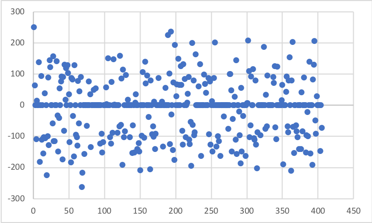

```{r setup, include=FALSE}
knitr::opts_chunk$set(echo = TRUE, warning = FALSE)
library(ggplot2)
library(ggthemes)
library(readxl)
library(extrafont)
font_import()
loadfonts(device = "win")
opros <- read_xlsx("ProgOprosEdited.xlsx")
```

# Опрос программистов

## Вступление

Для того, чтобы создавать какое-либо системное или прикладное программное обеспечение,
следует изучить целевую аудиторию потенциального продукта и интересы его возможных
потребителей.

*Penza Street* заинтересована в создании инструментов, помогающих программистам,
поэтому решила провести опрос среди программистов и попытаться понять, что это
за люди, и чего они хотят.

Результаты исследования представлены ниже. Не все результаты были правильно и грамотно
интерпретированы, так как сама структура опроса обладана массой изъянов. Компания
*Penza Street* не рискнула проводить второй, более качественный опрос во избежание
утери доверия среди целевой аудитории.

О серьёзности некоторых выводов говорить не приходится, поэтому, надеемся, вам
понравится количество юмора в статье, ибо некоторые закономерности представляют из себя
откровенный бред (*Но, статистически вероятный бред*).

### От автора

*Penza Street Analitics* - дочерняя организация от *Penza Street Company*, уникальной
в своём роде компании. В чём её уникальность? Хотя бы в том, что все возможные
должности в ней занимает один человек, а сама компания не закреплена ни одним правовым
актом ни одной страны мира.

Так что, дорогие читатели. [*Павел Соломатин*](https://vk.com/crave_ozer_man), приятно познакомиться.

## История данных

Данные, использующиеся в опросе, были собраны за август 2019 года. В данных хранятся
сведения о `r nrow(opros)` программистах.

[Опрос](https://forms.yandex.ru/u/5d4336b07effdd03528c193c/) 
является до сих пор открытым, можете заполнить анкету. Это очень поможет
~~(смех из-под стола)~~.

Программисты по себе люди замкнутые и большинстве своём разрозненные личности.
Собрать их в одном месте было нелегко. Если вам когда-то повезло пройти этот опрос,
то скорее всего вы относились к этим категориям людей:

1. Выпускники Яндекс.Лицея 2019 года, которые были в офисе Яндекса на выпускном. 
(автор и сам таким является)
2. Участники летней смены образовательного центра "Сириус" 
(отдельная благодарность [*Алексею Медведеву*](https://vk.com/medal99) за помощь
в сборе данных)
3. Программисты Пензы, которые каким-либо образом знакомы с автором статьи.

## Математический аппарат исследования

> Кто считает себя бородатым гуру статистики или просто не хочет вникать в вот это
вот всё, может смело пропустить этот раздел.

Математика - это всегда не просто, поэтому начнём издалека.

В основе исследования лежит статистика как наука в её чистом виде. Субъекты исследования - программисты. Объект исследования - предпочтения и навыки 
программистов и прочих посетителей опроса в мире информационных технологий.
В данном случае, ответы - это свойства объектов, то есть опрошенных.

Любые критерии могут быть разделены на качественные и количественные. Большинство
критериев в опросе было качественными, так как не было вопросов в стиле "оцените
это по шкале от 1 до 10". В это тоже есть минус опроса - нельзя ответить на вопрос
"сколько?". Качественные признаки ещё называют номинативными.

Однако, статистика на то и наука, что умеет много чего. Например:

*Для одной переменной*:

1. Если она качественная, проверить её на равномерность распределения (в каждой
группе элементы встречаются одинаково часто)
2. Если она количественная, проверить её на нормальность распределения (особый вид
распределения, выглядит как-то так)

За первый пункт отвечает 
[Критерий Хи-квадрат](https://en.wikipedia.org/wiki/Chi-squared_test),
а за второй 
[Тест Шапиро-Уилка](https://en.wikipedia.org/wiki/Shapiro%E2%80%93Wilk_test).

> Правда, как оказалось, данные вышли далеко не равномерные и не нормальные.
Но статистика и это может обойти

*Для двух переменных*:

1. Если обе качественные, то проверить их на связанность, или *корреляцию*.
2. Если одна качественная, а другая количественная, то проверить различие количественного
признака при разбиении на группы.
3. Если обе качественные, то проверить на пропорциональность групп по двум признакам.

За первый пункт отвечает [Коэфиициент корреляции Пирсона](https://en.wikipedia.org/wiki/Pearson_correlation_coefficient),
за второй - [Дисперсионный анализ](https://en.wikipedia.org/wiki/Analysis_of_variance),
а за третий - [Точный тест Фишера](https://en.wikipedia.org/wiki/Fisher%27s_exact_test)

> Правда, все первые два теста требуют "нормальности" данных, которой в этих данных нет.

Поэтому существуют их непараметрические аналоги:

1. [Коэффициент корреляции Кендала](https://en.wikipedia.org/wiki/Kendall_rank_correlation_coefficient)
2. [Тест Краскела-Уоллиса](https://en.wikipedia.org/wiki/Kruskal%E2%80%93Wallis_one-way_analysis_of_variance)

При визуализации данных будут использованы два вида графиков:

1. [Столбчатая гистограмма](https://en.wikipedia.org/wiki/Bar_chart)

2. [Диаграмма рассеяния](https://en.wikipedia.org/wiki/Scatter_plot)


## Программное обеспечение, использованное в исследовании

> Кто не хочет вникать в то, что такое R, и как было реализовано это исследование, может
смело пропускать этот раздел.

### Ссылки на программное обеспечение

В исследовании был использован язык программирования [**R**](https://www.r-project.org/)
версии `r getRversion()`.

Готовый файл статьи был получен с помощью пакета [RMarkdown](https://rmarkdown.rstudio.com)

Для визуализации был использован пакет [ggplot2](https://ggplot2.tidyverse.org/),
а также [ggthemes](https://CRAN.R-project.org/package=ggthemes). Для отображения
красивых шрифтов на графиках был использован пакет
[extrafont](https://CRAN.R-project.org/package=extrafont)

Для загрузки и выгрузки данных через формат .xlsx были использованы библиотеки
[readxl](https://CRAN.R-project.org/package=readxl) и
[writexl](https://CRAN.R-project.org/package=writexl)

### Код исследования

Дабы не грузить читателей кодовыми вставками, весь код исследования будет записан 
в одном месте - здесь.

Полную версию кода исследования можно увидеть на
[GitHub](https://github.com/PenzaStreetGames/ProgOpros)

```{r echo=TRUE, warning=FALSE, message=FALSE, cache=TRUE}
# rm(list = ls())
options(stringsAsFactors = TRUE)
library(readxl)
library(dplyr)
opros <- read_excel("ProgOprosEdited.xlsx")
opros <- select(opros, -number) # колонка номеров не нужна

# Функция, преобразующая набор строк в фактор (словарь)
factorise <- function(opros) {
  factoring_cols <-
    c(
      "gender",
      "status",
      "processor",
      "microboard",
      "desctop_os",
      "mobile_os",
      "editor_theme",
      "cycle_recursion",
      "cycle",
      "java_kotlin",
      "zero_division",
      "indexing",
      "typing",
      "slow_python",
      "list_mutable",
      "sugar",
      "list_expressions",
      "ternar_module",
      "patterns",
      "mobile_desctop",
      "web",
      "back_front_end",
      "flask_django",
      "python",
      "cpp",
      "javascript",
      "pascal",
      "csharp",
      "java",
      "c",
      "php",
      "kotlin",
      "lua",
      "scratch",
      "basic",
      "go",
      "ruby",
      "fasm",
      "bf",
      "haskel",
      "pycharm",
      "vscode",
      "idle",
      "notepad",
      "notepadpp",
      "wing",
      "sublime",
      "jupiter",
      "atom",
      "console",
      "machine_learning",
      "big_data",
      "metaprog",
      "quantum",
      "cryptography",
      "math"
    )
  colnames(opros)
  for (string in factoring_cols) {
    # print(string)
    opros[[string]] <- factor(opros[[string]])
  }
  
  return(opros)
}
df_struct <- list() # список, хранящий данные о структуре данных
df_struct$numeric_vars <- # список количественных переменных
  c(
    "languages_number",
    "editors_number",
    "future_number",
    "humour",
    "other_opinion",
    "sugar_using",
    "python_discontent",
    "middle_answers",
    "dont_know",
    "web_using",
    "apple"
  )
df_struct$quality_vars <- # список качественных переменных
  c(
    "gender",
    "status",
    "processor",
    "microboard",
    "desctop_os",
    "mobile_os",
    "editor_theme",
    "cycle_recursion",
    "cycle",
    "java_kotlin",
    "zero_division",
    "indexing",
    "typing",
    "slow_python",
    "list_mutable",
    "sugar",
    "list_expressions",
    "ternar_module",
    "patterns",
    "mobile_desctop",
    "web",
    "back_front_end",
    "flask_django",
    "python",
    "cpp",
    "javascript",
    "pascal",
    "csharp",
    "java",
    "c",
    "php",
    "kotlin",
    "lua",
    "scratch",
    "basic",
    "go",
    "ruby",
    "fasm",
    "bf",
    "haskel",
    "pycharm",
    "vscode",
    "idle",
    "notepad",
    "notepadpp",
    "wing",
    "sublime",
    "jupiter",
    "atom",
    "console",
    "machine_learning",
    "big_data",
    "metaprog",
    "quantum",
    "cryptography",
    "math"
  )
df_struct$vars <- colnames(opros) # список всех переменных
result <- list() # список для хранения промежуточных и итоговых результатов

opros <- factorise(opros) # факторизация всех сторковых столбцов
# str(opros)

## Стадия 1. Простая предобработка и гипотезы

# Simple tables
result$simple_tables <- apply(opros, 2, function(x) 
  round(prop.table(table(x)), digits = 3))

# Simple Fisher Test
result$simple_fisher_test <- apply(opros, 2, function(x)
  chisq.test(table(x)))

# Shapiro Test
result$shapiro_test <- lapply(opros[df_struct$numeric_vars], 
                              function(x) shapiro.test(x))

## Стадия 2. Двойные таблицы и взаимосвязи

# Double tables
result$double_tables <- lapply(opros, function(x)
  lapply(opros, function(y) round(prop.table(table(x, y)), digits = 3)))

# Check equals
# sapply(opros, function(x) 
#   sum(sapply(opros, function(y) all(as.vector(x) == as.vector(y)))))
# all rigth

# Double Fisher Test
result$double_fisher_test <- lapply(opros[df_struct$quality_vars], function(x) 
  lapply(opros[df_struct$quality_vars][sapply(opros[df_struct$quality_vars], function(z) !all(as.vector(x) == as.vector(z)))], 
         function(y) fisher.test(table(x, y), simulate.p.value = T)))

# Cor test Kendall
result$cor_test_kendal <- lapply(opros[df_struct$numeric_vars], function(x) 
  lapply(opros[df_struct$numeric_vars]
         [sapply(opros[df_struct$numeric_vars], function(z) !all(as.vector(x) == as.vector(z)))],
         function(y) cor.test(x, y, method = "kendall")))

# Kruskal test
result$kruskal_test <- lapply(opros[df_struct$numeric_vars], function(x)
  lapply(opros[df_struct$quality_vars], function(y)
    kruskal.test(x, y)))

## Стадия 3. Исследование взаимосвязей

# Researching edges
get_edges <- function(data, level) {
  df <- data.frame(x = c(), y = c(), p = c())
  lapply(names(data), function(x)
    lapply(names(data[[x]]), function(y) 
    { 
      if (data[[x]][[y]]$p.value < level) 
        if (!(paste(x, y) %in% c(apply(df, 1, function(x) paste(x["x"], x["y"])),
                                 apply(df, 1, function(x) paste(x["y"], x["x"])))))
          df <<- rbind(df, data.frame(x = x, y = y, p = data[[x]][[y]]$p.value)) 
    }
    ))
  df <- df[df$p < level,]
  df$p_log <- abs(round(log(df$p, base = 10)))
  df
}

# Removing obvious edges in Kruskal test
remove_obvious_edges <- function(data) {
  obvious_edges <- list(
    humour = c("gender", "status", "editor_theme"),
    other_opinion = c("zero_division", "indexing", "typing"),
    python_discontent = c("slow_python", "list_mutable", "sugar"),
    sugar_using = c("list_expressions", "ternar_module", "patterns"),
    apple = c("mobile_os", "desctop_os"),
    dont_know = c("microboard", "list_expressions", "ternar_module", "patterns", "flask_django"),
    web_using = c("web", "flask_django"),
    middle_answers = c("processor", "desctop_os", "mobile_os", "cycle_recursion", 
                       "cycle", "java_kotlin", "slow_python", "list_mutable", "sugar",
                       "mobile_desctop", "flask_django"),
    languages_number = c("python", "cpp",
                         "javascript", "pascal", "csharp", "java", "c",
                         "php", "kotlin", "lua", "scratch", "basic",
                         "go", "ruby", "fasm", "bf", "haskel"),
    editors_number = c("pycharm", "vscode", "idle", "notepad",
                       "notepadpp", "wing", "sublime", "jupiter",
                       "atom", "console"),
    future_number = c("machine_learning", "big_data", "metaprog",
                      "quantum", "cryptography", "math")
  )
  answer <- data.frame(x = c(), y = c(), p = c(), p_log = c())
  apply(result$important_edges$kruskal_test, 1, function(x) {
    if (!(x[["x"]] %in% names(obvious_edges) & 
          any(sapply(unlist(obvious_edges[as.vector(x[["x"]])]), function(z) as.vector(x[["y"]]) == z)))) {
      answer <<- rbind(answer, data.frame(x = c(x["x"]), y = c(x["y"]), 
                                          p = c(x["p"]), p_log = c(x["p_log"])))
    }
  })
  row.names(answer) <- NULL
  answer
}

get_all_edges <- function(level) {
  result$important_edges$cor_test <<- get_edges(result$cor_test_kendal, level)
  result$important_edges$fisher_test <<- get_edges(result$double_fisher_test, level)
  result$important_edges$kruskal_test <<- get_edges(result$kruskal_test, level)
  result$important_edges$kruskal_test <<- remove_obvious_edges(result$important_edges$kruskal_test)
  
  # Uniting edges
  result$important_edges$all <<- rbind(result$important_edges$fisher_test, result$important_edges$cor_test,
                                       result$important_edges$kruskal_test)
  result$important_edges$all$x <<- as.character(result$important_edges$all$x)
  result$important_edges$all$y <<- as.character(result$important_edges$all$y)
  result$important_edges$all$p <<- as.numeric(result$important_edges$all$p)
  result$important_edges$all$p_log <<- as.numeric(result$important_edges$all$p_log)
  result$important_edges$all
}
result$important_edges$all <- get_all_edges(0.05)

find_opros_col <- function(x) {
  names(opros)[sapply(names(opros), function(y) all(as.vector(opros[[y]]) == as.vector(x)))]
}

# str(result$important_edges$all)
result$edged_vars <- lapply(opros, function(x) {
  x <- find_opros_col(x)
  r <- apply(result$important_edges$all[
    apply(result$important_edges$all, 1, function(y)
      y["x"] == x | y["y"] == x),], 1, function(y) {
        ifelse(y["x"] == x, y["y"], y["x"])
      })
  names(r) <- NULL
  r})
# result$edged_vars

result$edged_vars_list <- data.frame(var = df_struct$vars, 
                                     edged_vars = sapply(opros, function(x) {
                                       x <- find_opros_col(x)
                                       paste(result$edged_vars[[x]], collapse = " ")
                                     }))

var_labels <- c(gender = "Пол",
                status = "Социальный\nстатус",
                languages_number = "Количество используемых языков",
                editors_number = "Количество используемых редакторов",   
                future_number = "Количество выбранных перспективных отраслей",
                humour = "Коэффциент юмора",
                other_opinion = "Коэффициент другого мнения",
                python_discontent = "Коэффициент недовольства питоном",
                sugar_using = "Коэффициент использования синтаксического сахара",
                middle_answers = "Коэффициент лояльности ответов",
                dont_know = "Коэффициент незнания",
                web_using = "Коэффициент использования web'а",     
                apple = "Коэффициент лояльности к Apple",
                processor = "Выбор процессора",
                microboard = "Выбор микроплаты",
                desctop_os = "Выбор\nнастольной ОС",
                mobile_os = "Выбор\nмобильной ОС",
                editor_theme = "Выбор\nтемы редактора",
                cycle_recursion = "Цикл\nили\nрекурсия",
                cycle = "Выбор\nвида цикла",
                java_kotlin = "Java\nили\nKotlin",
                zero_division = "Мнение\nо делении\nна ноль",
                indexing = "Выбор индексации",
                typing = "Сколько будет\n1 + \"а\"",           
                slow_python = "Мнение\nо скорости\nпитона",
                list_mutable = "Отношение\nк изменяемости\nсписков в питоне",
                sugar = "Мнение\nо \"сахарности\"\nпитона",
                list_expressions = "Использование\nсписочных\nвыражений",
                ternar_module = "Использование\nтернарного\nмодуля",
                patterns = "Использование\nшаблонов\nпроектирования",
                mobile_desctop = "Мобильная\nразработка\nили\nдесктоп",
                web = "Необходимость\nвеба",           
                back_front_end = "Предпочитаемая\nотрасль\nвеба",
                flask_django = "Flask\nили\nDjango",
                python = "Использование\nPython",
                cpp = "Использование\nC++",        
                javascript = "Использование\nJavaScript",
                pascal = "Использование\nPascal",
                csharp = "Использование\nC#",
                java = "Использование\nJava",
                c = "Использование\nC",
                php = "Использование\nPHP",
                kotlin = "Использование\nKotlin",
                lua = "Использование\nLua",      
                scratch = "Использование\nScratch",
                basic = "Использование\nBasic",
                go = "Использование\nGo",
                ruby = "Использование\nRuby",
                fasm = "Использование\nFASM",
                bf = "Использование\nBrainfuck",
                haskel = "Использование\nHaskel",
                pycharm = "Использование\nPyCharm",
                vscode = "Использование\nVisual Studio\nCode",
                idle = "Использование\nIDLE",
                notepad = "Использование\nБлокнота",
                notepadpp = "Использование\nNotepad++",
                wing = "Использование\nWing",
                sublime = "Использование\nSublime Text",
                jupiter = "Использование\nJupiter\nNotebook",
                atom = "Использование\nAtom", 
                console = "Использование\nконсоли",
                machine_learning = "Ожидание\nразвития\nмашинного\nобучения",
                big_data = "Ожидание\nразвития\nбольших\nданных",
                metaprog = "Ожидание\nразвития\nметапрограммирования",        
                quantum = "Ожидание\nразвития\nквантовой\nлогики",
                cryptography = "Ожидание\nразвития\nкриптографии",
                math = "Ожидание\nразвития\nприкладной\nматематики")
spaced_var_labels <- sapply(var_labels, function(x) gsub("\n", " ", x))

## Стадия 4. Отрисовка графиков

library(ggplot2)
library(extrafont)
loadfonts(device = "win")

theme_pablo <- theme(panel.background = element_rect(fill = "grey70"), 
                     plot.background = element_rect(fill = "grey60"),
                     legend.background = element_rect(fill = "grey80"),
                     text = element_text(family = "Comic Sans MS"),
                     axis.text.x = element_text(angle = 30, hjust = 1))

draw_plot <- function(x, y) {
  if (x %in% df_struct$numeric_vars & y %in% df_struct$numeric_vars) {
    random_colors <- colors()[sample(1:length(colors()), size = 2, replace = F)]
    plt <- ggplot(opros, aes(x = opros[[x]], y = opros[[y]], 
                             size = I(5), color = I(random_colors[1])))+
      geom_smooth(method = "lm", se = F, color = I(random_colors[2]), size = I(3))+
      geom_point()+
      scale_x_continuous(breaks = seq(1:10))+
      geom_jitter()+
      xlab(spaced_var_labels[x])+
      ylab(spaced_var_labels[y])+
      ggtitle(paste("Взаимосвязь переменных\n", spaced_var_labels[x], "и",
                    spaced_var_labels[y]))+
      theme_pablo
  }
  else if (x %in% df_struct$numeric_vars & y %in% df_struct$quality_vars) {
    plt <- ggplot(opros, aes(x = opros[[x]], fill = opros[[y]], color = I("black")))+
      geom_histogram(alpha = 0.8, binwidth = 1)+
      facet_wrap(~ opros[[y]], nrow = 3)+
      xlab(spaced_var_labels[x])+
      ylab("Частота")+
      ggtitle(paste("Взаимосвязь переменных\n", spaced_var_labels[x], "и",
                    spaced_var_labels[y]))+
      scale_fill_brewer(name = var_labels[y],
                        type = "qual", palette = sample(1:8, size=1))+
      scale_x_continuous(breaks = seq(1:10))+
      theme_pablo
  }
  else if (x %in% df_struct$quality_vars & y %in% df_struct$numeric_vars) {
    plt <- ggplot(opros, aes(x = opros[[y]], fill = opros[[x]], color = I("black")))+
      geom_histogram(alpha = 0.8, binwidth = 1)+
      facet_wrap(~ opros[[x]], nrow = 3)+
      xlab(spaced_var_labels[y])+
      ylab("Количество")+
      ggtitle(paste("Взаимосвязь переменных\n", spaced_var_labels[x], "и",
                    spaced_var_labels[y]))+
      scale_fill_brewer(name = var_labels[x],
                        type = "qual", palette = sample(1:8, size=1))+
      scale_x_continuous(breaks = seq(1:10))+
      theme_pablo
  }
  else if (x %in% df_struct$quality_vars & y %in% df_struct$quality_vars){
    plt <- ggplot(opros, aes(x = opros[[x]], fill = opros[[y]], color = I("black")))+
      geom_histogram(stat = "count")+
      facet_wrap(~ opros[[y]])+
      xlab(spaced_var_labels[x])+
      ylab("Количество")+
      ggtitle(paste("Взаимосвязь переменных\n", spaced_var_labels[x], "и",
                    spaced_var_labels[y]))+
      scale_fill_brewer(name = var_labels[y],
                        type = "qual", palette = sample(1:8, size=1))+
      theme_pablo
  }
  plt
}
# gsub(" ", "_", gsub("\n ", "-", draw_plot("gender", "status")$labels$title))
df <- data.frame(x = c(), y = c())
result$important_plots <- lapply(opros, function(x) {
  x <- find_opros_col(x)
  lapply(opros[unlist(result$edged_vars[x])], function(y) {
    y <- find_opros_col(y)
    plt <- draw_plot(x, y)
#      if (!(paste(x, y) %in% c(apply(df, 1, function(x) paste(x["x"], x["y"])),
#                             apply(df, 1, function(x) paste(x["y"], x["x"]))))) {
#      df <<- rbind(df, data.frame(x = x, y = y))
#      i <- gsub("\"", "", gsub(" ", "_", gsub("\n ", "-", plt$labels$title)))
#      ggsave(file = paste0(getwd(), "/plots/important_plots/", i, ".png"), 
#             plot = plt, device = "png")}
    plt})})

## Стадия 5. Попытка визуализации взаимосвязей.

# Graph creating
library(igraph)
net <- list()
net$edges <- data.frame(from = result$important_edges$all$x,
                        to = result$important_edges$all$y,
                        weight = result$important_edges$all$p_log)
net$vertices <- data.frame(
  id = colnames(opros),
  type = ifelse(colnames(opros) %in% df_struct$numeric_vars, "numeric", "quality"))
graph <- graph.data.frame(net$edges, net$vertices, directed = F)
V(graph)$color <- ifelse(net$vertices$id %in% df_struct$numeric_vars, "orange", "skyblue")
E(graph)$width <- as.numeric(as.vector(net$edges$weight))
l <- layout.kamada.kawai(graph)
# plot(graph, layout= l, vertex.size = 15)
```

## Данные

### Ссылка

Используемые в опросе данные в предобработанном виде можно скачать по 
[ссылке](https://yadi.sk/i/WmRRsDzbnQ9H-g)

Для полноценной работы скрипта исследования следует скопировать файл данных в ту
же директорию, что и файл *Research.Rmd*.

### Структура данных

Всего в данных содержится `r length(colnames(opros))` признаков о 
`r length(rownames(opros))` программистах

> Быстро понять структуру данных можно, ознакомившись с 
[опросом](https://forms.yandex.ru/u/5d4336b07effdd03528c193c/)

> Рядом с переменной курсивом приведено её название в данных

#### Качественные переменные

##### Общие признаки
- Пол *gender* 
  - Мужской
  - Женский
  - Кафельный (*пол не уточнён*)
- Социальный статус *status*
  - Школьник
  - Студент
  - Работяга (трудоустроенный программист)
  - Фрилансер (программист, работающий на заказ)
  - Аутсорсер (внештатный программист)
  - Пенсионер (*наличие пенсионеров в данных весьма странно - IT рынок России не настолько стар*)

##### Железо
- Предпочитаемая марка процессора *processor*
  - Intel
  - AMD
  - Всё равно
- Выбор микроплаты *microboard*
  - Arduino
  - Raspberry Pi
  - Не, не слышал

##### Программное обеспечение
- Предпочитаемая настольная ОС *desctop_os*
  - Windows
  - Linux
  - MacOS
  - Лишь бы был комп
- Предпочитаемая мобильная ОС *mobile_os*
  - Android
  - iOS
  - Лишь бы был телефон
- Тема редактора кода *editor_theme*
  - Светлая
  - Тёмная
  - Не фильтрованная (*тест на выявление алкопрогеров*)

##### Общепрограммистские вопросы
- Цикл или рекурсия? *cycle_recursion* (*варианты ответа очевидны, имеется средний ответ*)
- For или While? *cycle*
- Java или Kotlin? *java_kotlin*
- Мнение о делении на ноль *zero_division*
  - Ошибка
  - Так нельзя делать
  - Бесконечность
- Выбор индексации *indexing*
  - С нуля
  - С единицы
  - С произвольного числа
- Сколько будет 1 + "а"? *typing*
  - Ошибка типа
  - "1а"
  - 98 (то есть 1 + utf8 код символа "a")

##### Вопросы о питоне
- Мнение о скорости питона *slow_python*
  - Нормально
  - Терпимо
  - Побыстрее бы
- Отношение к изменяемости списков *list_mutable*
  - Позитивное
  - Нейтральное
  - Негативное
- Мнение о "сахарности" питона *sugar*
  - Слишком много сахара
  - Достаточно
  - Можно было послаще

##### Вопросы о использовании синтаскического сахара
- Использование тернарного модуля *ternar_module*
  - Не знал
  - Не использую
  - Редко
  - Часто
- Использование списочных выражений *list_expressions* (*ответы такие же*)
- Использование шаблонов проетирования *patterns*
  - Не знал о них
  - В питоне неприменимы
  - Редко
  - Часто
  
##### Вопросы о сферах программирования
- Мобильная или десктоп разработка? *mobile_desctop*
- Использование веба *web*
  - Нет
  - Как прилагающееся
  - Конечно
- Бек или фронт энд? *back_front_end*
  - Бек-энд
  - Фронт-энд
  - Фул-стек
- Flask или Django? *flask_django*
  - Flask
  - Django
  - Не знаю
  - Оба потянут
  - Оба не тянут
  
##### Используемые языки

В опросе было рассмотрено 17 наиболее известных ЯП 
(Dart не выбрал никто, в данных его нет). Каждому языку в данных соответствует 
переменная с его названием:

*python*, *cpp*, *javascript*, *pascal*, *csharp*, *java*, *c*, *php*, *kotlin*, 
*lua*, *scratch*, *basic*, *go*, *ruby*, *fasm*, *bf*, *haskel*

В переменных хранятся значения "Использует" или "Не использует" в зависимости от ответа

##### Используемые редакторы
В опросе было рассмотрено 10 редакторов кода, предпочтительно для питона,
включая консоль. Каждому редактору в данных соответствует переменная с его названием:

*pycharm*, *vscode*, *idle*, *notepad*, *notepadpp*, *wing*, *sublime*, *jupiter*,
*atom*, *jupyter*

В переменных хранятся значения "Использует" или "Не использует" в зависимости от ответа

##### Перспективные направления
В качестве разгрузочного вопроса участникам опроса предлагалось ответить, какие
из отраслей IT являются, по их мнению, перспективными. Предлагалось
6 отраслей: большие данные, машинное обучение, квантовая логика, криптография,
метапрограммирование и прикладная математика:

*big_data*, *machine_learning*, *quantum*, *cryptography*, *metaprog*, *math*

В переменных хранятся значения "Ожидает" или "Не ожидает" в зависимости от ответа

#### Количественные переменные

Самым большим инструментарием по обработке данных статистика имеет для количественных
переменных. Однако, структура опроса была такова, что очевидными количественными
переменными были всего 3. Ещё 8 были получены путём объединения качественных переменных.

##### По имеющимся данным

- Количество языков программирования, которое знает программист *languages_number*
- Количество редакторов, используемых программистом *editors_number*
- Количество перспективных отраслей, которое видит программист *future_number*

##### Синтезированные из качественных

- Чувство юмора (или маргинальность) *humour*
  - Ответы про пенсионера, кафельный пол и нефильтрованную тему повышают условный
  показатель "юмора"
- Другое мнение *other_opinion*
  - Нестандартные ответы на вопросы об индексации, типизации и делении на ноль
  повышают условный показатель "другого мнения"
- Недовольство питоном *python_discontent*
  - Негативные ответы о возможностях питона повышают условный показатель 
  "недовольства питоном"
- Использование синтаксического сахара *suger_using*
  - Использование тернарного модуля, списочных выражений и шаблонов проектирования
  повышают условный показатель "использования сахара"
- Лояльность ответов *middle_answers*
  - Количество компромиссных ответов
- Коэффициент незнания *dont_know*
  - Количество ответов в духе "Не знаю"
- Использование веба *web_using*
  - Количество наиболее объемлющих ответов по тематике веба
- Лояльность к Apple *apple*
  - Предпочтение macOS и iOS прочим продуктам

Ответы на все вопросы анкеты были обязательны и в некоторых местах не имели
подходящего ответа, в этом есть минус опроса. Зато, в данных нет ни одного
пропущенного значения.

Кому нечего делать, может пересчитать количество упомянутых переменных :)

## Распределения ответов

